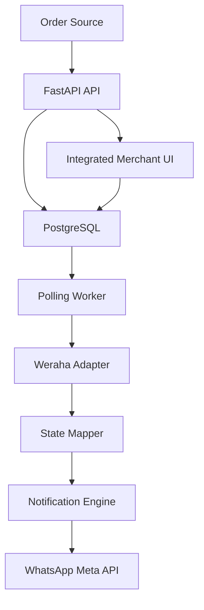
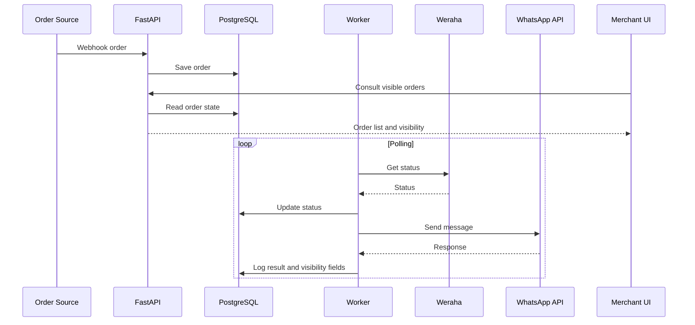

# ADR-001 — Stack Tecnológico y Arquitectura Base

---

## Contexto

Se requiere construir un MVP para un sistema de notificaciones post-compra vía WhatsApp con foco en:

* simplicidad
* velocidad de desarrollo
* bajo costo
* capacidad de iteración rápida
* visibilidad vendible al merchant desde el día 1

Basado en `PRD.md` y `RFC.md`, el MVP incluye:

* ingestión de órdenes
* polling logístico con Weraha
* envío de notificaciones por WhatsApp
* panel de visibilidad para merchant

El producto NO busca resolver:

* CRM
* chatbot
* múltiples couriers
* múltiples países
* analytics avanzados

---

## Decisión

Se adopta una arquitectura monolítica, priorizando velocidad y bajo costo operativo.

### Backend

* **FastAPI (Python)**

### Base de datos

* **PostgreSQL**

### Infraestructura

* **Heroku**

### Frontend

* **UI vendible desde el día 1**
* **No se adopta Next.js en el MVP**
* el panel se implementa como una UI integrada más simple dentro del backend
* la prioridad es reducir tiempo total a valor y costo operativo

### Repositorio

* **GitHub**

### Entorno de desarrollo

* **Cursor IDE**

---

## Justificación

### FastAPI

✔️ Alta velocidad de desarrollo  
✔️ Async-ready para polling e IO externo  
✔️ Encaja naturalmente con servicios, workers y adapters definidos en el RFC

---

### PostgreSQL

✔️ Relacional, adecuado para órdenes, estados y trazabilidad  
✔️ Permite consultas simples para panel de visibilidad  
✔️ Compatible con despliegue rápido en Heroku

---

### Heroku

✔️ Deploy rápido  
✔️ Bajo overhead DevOps  
✔️ Permite separar procesos web y worker  
✔️ Tiene un camino simple para scheduler y base de datos en MVP

❌ No optimizado para costo a escala  
❌ No es la opción final si el producto valida y aumenta volumen

---

### UI vendible desde día 1

✔️ El panel no es soporte interno: es parte del producto  
✔️ Debe mostrar valor visible al merchant desde la primera demo  
✔️ Debe poder enseñar:

* lista de órdenes
* estado actual
* última notificación enviada
* error visible
* timestamp

---

### UI integrada como decisión final de MVP

✔️ Reduce despliegues, coordinación y costo operativo  
✔️ Mantiene el principio de monolito primero  
✔️ Es suficiente para un panel vendible en pilotos pagos

❌ Puede limitar flexibilidad visual futura  
❌ Si el producto valida y necesita una UX más sofisticada, podrá extraerse luego a un frontend separado

---

### GitHub

✔️ Control de versiones  
✔️ Base razonable para CI/CD futura

---

### Cursor

✔️ Acelera scaffolding  
✔️ Reduce tiempo de traducción entre PRD, RFC y ejecución

---

## Tradeoffs

| Decisión | Beneficio | Costo |
| --- | --- | --- |
| Monolito | rapidez y menor complejidad | menor escalabilidad inicial |
| Heroku | simplicidad operativa | costo futuro y menor flexibilidad |
| Polling | control y facilidad de implementación | menor eficiencia que integración full event-driven |
| Meta API directo | menos intermediarios | integración inicial más sensible |
| UI vendible desde día 1 | mejor percepción de valor | requiere priorizar frontend antes |
| UI integrada en backend | menor costo y menor fricción | menor flexibilidad visual futura |

---

## Arquitectura General



---

## Flujo de notificación



---

## Infraestructura operativa mínima

Se define una operación mínima consistente con el RFC:

* **web process** para API y panel
* **worker process** para polling, mapeo y notificaciones
* **scheduler** para disparar ejecución periódica del polling
* **PostgreSQL** como fuente única de verdad

Objetivo operativo del MVP:

* mantener webhook, worker y panel con confiabilidad suficiente para pilotos pagos
* sostener tiempo a primera notificación menor a 1 día en tiendas correctamente configuradas

---

## Multi-merchant y aislamiento

Se decide que el MVP será multi-merchant desde la primera versión vendible.

Reglas:

* toda entidad de negocio se asocia a `store_id`
* el panel no es interno: cada merchant accede solo a su información
* órdenes, errores, configuraciones y visibilidad quedan aisladas por tienda

---

## Acceso al panel

Se adopta autenticación propia simple para el MVP.

Decisiones:

* cada merchant tendrá usuario y contraseña
* cada usuario pertenece a una sola tienda
* el panel filtra toda consulta por `store_id`
* no se implementan roles complejos ni SSO en esta fase

---

## Trazabilidad e idempotencia

Se adopta persistencia explícita de intentos de notificación.

Decisiones:

* cada intento se registra en una tabla dedicada
* la clave de idempotencia será `store_id:order_id:event_type`
* el sistema no debe enviar dos veces una notificación final exitosa para el mismo evento
* el panel mostrará el último estado visible a partir de esta trazabilidad

---

## Configuración por tienda

Se decide persistir configuración operativa por tienda en base de datos.

Incluye:

* configuración de Weraha
* estado de activación
* configuración de WhatsApp
* templates habilitados
* resultado de pruebas de onboarding

Esto evita depender de configuración global por aplicación para tiendas distintas.

---

## Topología de despliegue

La topología mínima del MVP en Heroku será:

* **web dyno** para API y panel
* **worker dyno** para polling, mapeo y notificaciones
* **scheduler** para disparar polling
* **postgres** como base única

---

## Estructura de repositorio

```bash
backend/
  app/
    api/
    services/
    models/
    workers/
    db/
    templates/
    static/

docs/
  PRD.md
  RFC.md
  ADR.md
```

Regla:

* la UI del MVP vive integrada al backend
* no se introduce un frontend separado en esta fase

---

## Estrategia de desarrollo

### Fase 1

* backend funcional
* base de datos
* ingestión de órdenes
* modelo multi-merchant base
* estructura de visibilidad en modelo de datos
* autenticación simple
* endpoint inicial para panel
* UI mínima vendible del merchant

---

### Fase 2

* polling worker
* integración Weraha (mock -> real)
* actualización de estados visibles

---

### Fase 3

* integración WhatsApp API
* envío real de notificaciones
* registro de errores, retries y trazabilidad visible
* persistencia de onboarding y configuración por tienda

---

### Fase 4

* endurecimiento operativo
* mejoras UX/UI
* métricas de piloto
* refinamiento de onboarding

---

## Lineamientos de UI del panel

Como el panel es parte vendible del MVP, debe cubrir desde la primera versión:

* acceso autenticado
* lista de órdenes
* estado logístico actual
* estado de notificación
* último evento/template enviado
* fecha de última notificación
* error visible si existe

Elementos opcionales, pero NO requeridos para MVP:

* filtros avanzados
* analytics avanzados
* roles complejos
* branding multi-tenant avanzado

---

## Herramientas de diseño recomendadas

### Recomendación principal

* **Penpot**

Sirve para:

* wireframes rápidos
* mockups de validación
* iteración con foco en claridad del panel

### Alternativas

* **Excalidraw** para flujos rápidos
* **tldraw** para diagramas simples

---

## Principios de arquitectura

* monolito primero
* desacoplar después
* observable desde el día 1
* panel vendible desde el día 1
* multi-merchant desde el día 1
* evitar sobreingeniería
* elegir la opción que reduzca tiempo total a valor

---

## Resultado esperado

Con este ADR:

✔️ el equipo tiene una arquitectura consistente con `PRD.md` y `RFC.md`  
✔️ el panel se trata como parte central del producto  
✔️ se reduce el riesgo de sobreingeniería en frontend  
✔️ se acelera el time-to-first-user con una base operativamente simple

---
