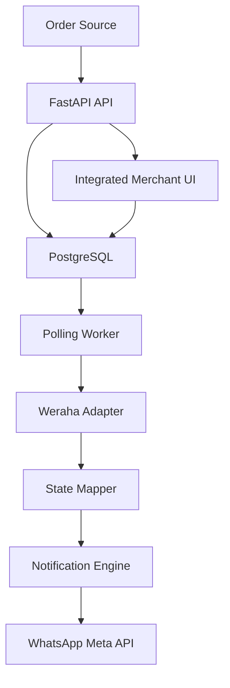
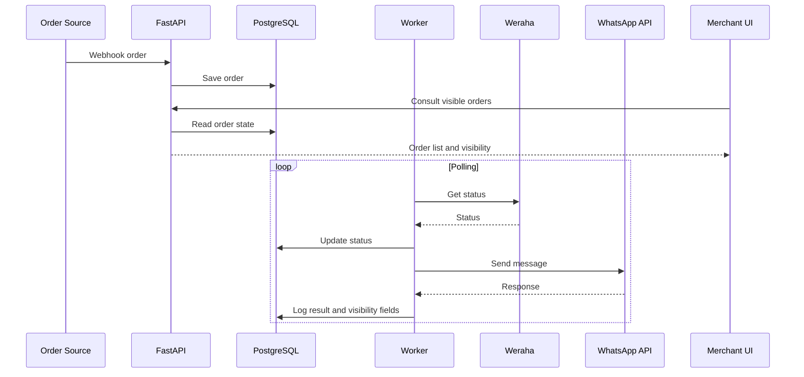

# ADR-001 — Stack Tecnológico y Arquitectura Base

---

## Contexto

Se requiere construir un MVP para un sistema de notificaciones post-compra vía WhatsApp con foco en:

* simplicidad
* velocidad de desarrollo
* bajo costo
* capacidad de iteración rápida
* visibilidad vendible al merchant desde el día 1

Basado en `PRD.md` y `RFC.md`, el MVP incluye:

* ingestión de órdenes
* polling logístico con Weraha
* envío de notificaciones por WhatsApp
* panel de visibilidad para merchant

El producto NO busca resolver:

* CRM
* chatbot
* múltiples couriers
* múltiples países
* analytics avanzados

---

## Decisión

Se adopta una arquitectura monolítica, priorizando velocidad y bajo costo operativo.

### Backend

* **FastAPI (Python)**

### Base de datos

* **PostgreSQL**

### Infraestructura

* **Heroku**

### Frontend

* **UI vendible desde el día 1**
* **No se adopta Next.js en el MVP**
* el panel se implementa como una UI integrada más simple dentro del backend
* la prioridad es reducir tiempo total a valor y costo operativo

### Repositorio

* **GitHub**

### Entorno de desarrollo

* **Cursor IDE**

---

## Justificación

### FastAPI

✔️ Alta velocidad de desarrollo  
✔️ Async-ready para polling e IO externo  
✔️ Encaja naturalmente con servicios, workers y adapters definidos en el RFC

---

### PostgreSQL

✔️ Relacional, adecuado para órdenes, estados y trazabilidad  
✔️ Permite consultas simples para panel de visibilidad  
✔️ Compatible con despliegue rápido en Heroku

---

### Heroku

✔️ Deploy rápido  
✔️ Bajo overhead DevOps  
✔️ Permite separar procesos web y worker  
✔️ Tiene un camino simple para scheduler y base de datos en MVP

❌ No optimizado para costo a escala  
❌ No es la opción final si el producto valida y aumenta volumen

---

### UI vendible desde día 1

✔️ El panel no es soporte interno: es parte del producto  
✔️ Debe mostrar valor visible al merchant desde la primera demo  
✔️ Debe poder enseñar:

* lista de órdenes
* estado actual
* última notificación enviada
* error visible
* timestamp

---

### UI integrada como decisión final de MVP

✔️ Reduce despliegues, coordinación y costo operativo  
✔️ Mantiene el principio de monolito primero  
✔️ Es suficiente para un panel vendible en pilotos pagos

❌ Puede limitar flexibilidad visual futura  
❌ Si el producto valida y necesita una UX más sofisticada, podrá extraerse luego a un frontend separado

---

### GitHub

✔️ Control de versiones  
✔️ Base razonable para CI/CD futura

---

### Cursor

✔️ Acelera scaffolding  
✔️ Reduce tiempo de traducción entre PRD, RFC y ejecución

---

## Tradeoffs

| Decisión | Beneficio | Costo |
| --- | --- | --- |
| Monolito | rapidez y menor complejidad | menor escalabilidad inicial |
| Heroku | simplicidad operativa | costo futuro y menor flexibilidad |
| Polling | control y facilidad de implementación | menor eficiencia que integración full event-driven |
| Meta API directo | menos intermediarios | integración inicial más sensible |
| UI vendible desde día 1 | mejor percepción de valor | requiere priorizar frontend antes |
| UI integrada en backend | menor costo y menor fricción | menor flexibilidad visual futura |

---

## Arquitectura General



---

## Flujo de notificación



---

## Infraestructura operativa mínima

Se define una operación mínima consistente con el RFC:

* **web process** para API y panel
* **worker process** para polling, mapeo y notificaciones
* **scheduler** para disparar ejecución periódica del polling
* **PostgreSQL** como fuente única de verdad

Objetivo operativo del MVP:

* mantener webhook, worker y panel con confiabilidad suficiente para pilotos pagos
* sostener tiempo a primera notificación menor a 1 día en tiendas correctamente configuradas

---

## Multi-merchant y aislamiento

Se decide que el MVP será multi-merchant desde la primera versión vendible.

Reglas:

* toda entidad de negocio se asocia a `store_id`
* el panel no es interno: cada merchant accede solo a su información
* órdenes, errores, configuraciones y visibilidad quedan aisladas por tienda

---

## Acceso al panel

Se adopta autenticación propia simple para el MVP.

Decisiones:

* cada merchant tendrá usuario y contraseña
* cada usuario pertenece a una sola tienda
* el panel filtra toda consulta por `store_id`
* no se implementan roles complejos ni SSO en esta fase

---

## Trazabilidad e idempotencia

Se adopta persistencia explícita de intentos de notificación.

Decisiones:

* cada intento se registra en una tabla dedicada
* la clave de idempotencia será `store_id:order_id:event_type`
* el sistema no debe enviar dos veces una notificación final exitosa para el mismo evento
* el panel mostrará el último estado visible a partir de esta trazabilidad

---

## Configuración por tienda

Se decide persistir configuración operativa por tienda en base de datos.

Incluye:

* configuración de Weraha
* estado de activación
* configuración de WhatsApp
* templates habilitados
* resultado de pruebas de onboarding

Esto evita depender de configuración global por aplicación para tiendas distintas.

---

## Topología de despliegue

La topología mínima del MVP en Heroku será:

* **web dyno** para API y panel
* **worker dyno** para polling, mapeo y notificaciones
* **scheduler** para disparar polling
* **postgres** como base única

---

## Estructura de repositorio

```bash
backend/
  app/
    api/
    services/
    models/
    workers/
    db/
    templates/
    static/

docs/
  PRD.md
  RFC.md
  ADR.md
```

Regla:

* la UI del MVP vive integrada al backend
* no se introduce un frontend separado en esta fase

---

## Estrategia de desarrollo

### Fase 1

* backend funcional
* base de datos
* ingestión de órdenes
* modelo multi-merchant base
* estructura de visibilidad en modelo de datos
* autenticación simple
* endpoint inicial para panel
* UI mínima vendible del merchant

---

### Fase 2

* polling worker
* integración Weraha (mock -> real)
* actualización de estados visibles

---

### Fase 3

* integración WhatsApp API
* envío real de notificaciones
* registro de errores, retries y trazabilidad visible
* persistencia de onboarding y configuración por tienda

---

### Fase 4

* endurecimiento operativo
* mejoras UX/UI
* métricas de piloto
* refinamiento de onboarding

---

## Lineamientos de UI del panel

Como el panel es parte vendible del MVP, debe cubrir desde la primera versión:

* acceso autenticado
* lista de órdenes
* estado logístico actual
* estado de notificación
* último evento/template enviado
* fecha de última notificación
* error visible si existe

Elementos opcionales, pero NO requeridos para MVP:

* filtros avanzados
* analytics avanzados
* roles complejos
* branding multi-tenant avanzado

---

## Herramientas de diseño recomendadas

### Recomendación principal

* **Penpot**

Sirve para:

* wireframes rápidos
* mockups de validación
* iteración con foco en claridad del panel

### Alternativas

* **Excalidraw** para flujos rápidos
* **tldraw** para diagramas simples

---

## Principios de arquitectura

* monolito primero
* desacoplar después
* observable desde el día 1
* panel vendible desde el día 1
* multi-merchant desde el día 1
* evitar sobreingeniería
* elegir la opción que reduzca tiempo total a valor

---

## ADR-002 — Onboarding Tiendanube (OAuth `state` + mismo `Store`)

### Contexto

El callback OAuth de Tiendanube (MS-I01) puede crear o actualizar un `Store` solo por `user_id` de TN, desalineado del merchant que ya inició sesión en el panel con otro `store_id` (JWT). Se necesita vincular la instalación TN al **mismo** `Store` del usuario autenticado.

### Decisión

1. **`state` OAuth = JWT de corta vida** firmado con `SECRET_KEY`, con `store_id`, `purpose: tn_oauth` y expiración (15 min). Se genera en `GET /api/integrations/tiendanube/install-url` (requiere Bearer) y TN lo devuelve en el callback.
2. **Callback con `state`**: intercambio de código, actualización de `Store`, `StoreInstallation` y redirección **HTTP 302** a `{APP_BASE_URL}/onboarding?success=1` o `?error=…` para UX en navegador (no 409 JSON en este flujo).
3. **Conflictos**: si el `Store` ya tiene `external_store_id` distinto al `user_id` TN → redirect `error=store_conflict` (desvincular / soporte fuera de MVP).
4. **Legacy sin `state`**: se conserva respuesta JSON para instalaciones iniciadas desde el ecosistema TN sin panel.
5. **Token endpoint**: `exchange_code` envía cuerpo **JSON**; si en producción TN exigiera solo `form-urlencoded`, añadir fallback documentado.

### Consecuencias

* Gating en panel (`needs_tiendanube`) y guards en plantillas alinean órdenes/webhooks futuros al `store_id` correcto.
* El merchant siempre pasa por flujo autenticado antes de autorizar TN en el escenario “panel primero”.
* UX: guía pública `/ayuda/conectar-tiendanube`, onboarding con pasos y URLs copiables expuestas vía `GET /api/onboarding/status` para reducir fricción y tickets de soporte.
* **Seed local:** `SEED_TN_LINK_MODE=oauth_ready` evita `external_store_id` ficticio (`demo-paraguay-tn`) que provocaba `store_conflict` al vincular una tienda TN real; modo `demo` conserva el panel “precargado” sin OAuth.

---

## ADR-003 — Webhooks de pedido Tiendanube (payload mínimo + fetch API)

### Contexto

Los webhooks de TN para `order/*` solo incluyen `store_id`, `event` e `id` de la orden ([documentación oficial](https://tiendanube.github.io/api-documentation/resources/webhook)). No alcanza para teléfono ni tracking.

### Decisión

1. Tras validar HMAC, resolver `Store` por `external_store_id == str(store_id)` y obtener `access_token` de `StoreInstallation` TN activa.
2. **`order/created` / `order/paid`**: `GET /v1/{user_id}/orders/{id}` → persistir `Order` con `contact_phone` / `customer` según respuesta API.
3. **`order/fulfilled`**: priorizar tracking en el cuerpo del POST si viene (`shipping_*` o `tracking_info`); si no, `GET` con `aggregates=fulfillment_orders` y leer `tracking_info.code` en `fulfillment_orders` / `fulfillments`.
4. **Rendimiento**: timeout ~2,5s en el cliente HTTP; si orden existe y el webhook trae tracking, no llamar a la API.
5. **Errores transitorios de API**: responder **503** para que TN reintente; sin token TN → **200** `ignored` (evita reintentos infinitos por config rota).
6. **`store/redact`**: `Store.status = redacted`, instalaciones TN `is_active=False` (worker ya filtra `status=active`).

### Consecuencias

* Dependencia de token válido y scopes (p. ej. lectura de órdenes) en la app TN.
* Menos “magia” sobre payloads no documentados; tests usan mock de API.

---

## ADR-004 — Registro merchant self-service (`POST /auth/register`)

### Contexto

Depender de `SEED_USER_EMAIL` / `SEED_USER_PASSWORD` en `.env` para “el usuario del panel” no escala a producción ni refleja el flujo real del vendedor; además genera confusión en Docker/logs cuando esas variables faltan o no coinciden con el seed.

### Decisión

1. **`POST /auth/register`**: body JSON con `email`, `password` (mín. 8 caracteres) y `store_name` o `storeName` (2–150 caracteres); crea en una transacción `Store` (sin `external_store_id` hasta OAuth), `StoreSettings` con `onboarding_status=pending`, `StoreUser` con `role=owner`; responde **201** + `LoginResponse` (JWT).
2. **Email duplicado**: **409** con mensaje claro; `IntegrityError` en commit también se mapea a 409.
3. **UI**: `GET /register` (Jinja); enlaces desde login y ayuda pública; tras registro, redirigir a `/onboarding` si `needs_tiendanube`.
4. **`GET /me`**: expone `tiendanube_user_id` (`Store.external_store_id`) y `needs_tiendanube` (misma regla que `GET /api/onboarding/status`: instalación TN activa con token).
5. **Seed demo**: credenciales por defecto definidas en `scripts/seed_demo_data.py`; `SEED_USER_*` solo si hace falta otro email/contraseña para dev/CI.

### Consecuencias

* Milestone **MS-ONB02** en `docs/MILESTONES.md`; alineado con **MS-ONB01** (OAuth después de tener cuenta).
* Despliegue normal sin usuario “mágico” en variables de entorno; el demo técnico sigue disponible vía script.

---

## ADR-005 — WhatsApp Cloud API (Meta): plantillas, errores Graph y webhook

### Contexto

El envío mínimo a `/{phone-number-id}/messages` sin `template.components` falla cuando las plantillas tienen variables. Meta exige webhook con verificación y firma `X-Hub-Signature-256` para producción y buenas prácticas. Los milestones **MS-I06** e **MS-I07** en `docs/MILESTONES.md` detallan el alcance.

### Decisión

1. **Plantillas con parámetros**: si `send_template_message` recibe `params`, se arma `template.components` con un bloque `body` y parámetros `type: text` en orden estable: `order_id` primero, luego el resto de claves alfabéticamente. Flag `whatsapp_include_body_params` para plantillas sin variables.
2. **Errores HTTP**: parsear JSON `error.code` / `message`; propagar `Retry-After`; heurística `graph_send_error_may_benefit_from_retry` para no reintentar errores permanentes.
3. **Webhook** (`GET` + `POST /webhooks/whatsapp`): verify token + firma `META_APP_SECRET` en POST.
4. **Trazabilidad de entrega**: `NotificationAttempt` con `provider_delivery_status` correlacionado por `wamid`.
5. **Credenciales por tienda (MS-I08)**: `store_settings` + `resolve_for_store`; fallback opcional `WHATSAPP_ALLOW_GLOBAL_FALLBACK`; `whatsapp_enabled` en el motor de notificaciones.

### Consecuencias

* Migraciones Alembic en `notification_attempts` y `store_settings`.
* Ver `docs/WHATSAPP_META.md` y `docs/META_GO_LIVE_CHECKLIST.md`.

---

## Resultado esperado

Con este ADR:

✔️ el equipo tiene una arquitectura consistente con `PRD.md` y `RFC.md`  
✔️ el panel se trata como parte central del producto  
✔️ se reduce el riesgo de sobreingeniería en frontend  
✔️ se acelera el time-to-first-user con una base operativamente simple

---
