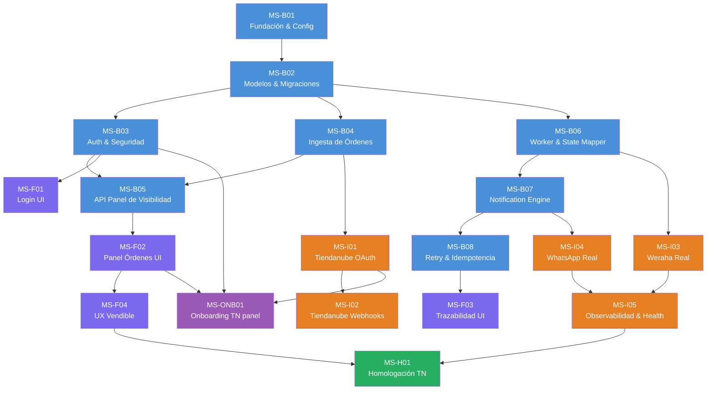

# Plan de Implementación por Milestones — WTA MVP

---

## Resumen ejecutivo

Este plan descompone el MVP del WhatsApp Tracking Assistant en **18 milestones** organizados en 3 tracks paralelos (Backend, Frontend, Integración) + **Onboarding producto** + 1 milestone post-MVP (Homologación Tiendanube).

- **Track Backend** (B01–B08): 8 milestones — desde fundación hasta notificaciones con idempotencia
- **Track Frontend** (F01–F04): 4 milestones — desde login hasta panel vendible con trazabilidad
- **Track Integración** (I01–I05): 5 milestones — Tiendanube OAuth, webhooks, Weraha real, WhatsApp real, observabilidad
- **Onboarding** (ONB01): 1 milestone — vinculación obligatoria Tiendanube desde el panel (merchant ya autenticado)
- **Post-MVP** (H01): 1 milestone — homologación Tiendanube App Store

**Metodología**: TDD estricto (Red → Green → Refactor) en cada milestone.

**Timeline estimado**: 6–8 semanas con un desarrollador fullstack asistido por agentes AI.

---

## Dependency Graph



---

## Track Backend (MS-B01 a MS-B08)

---

### MS-B01: Fundación & Config

- **Track**: Backend
- **Depende de**: ninguno
- **Objetivo**: FastAPI app base ejecutable con config desde env vars y health checks

**Tasks**:

- [ ] Crear `backend/app/main.py` con FastAPI app
- [ ] Crear `backend/app/core/config.py` con pydantic-settings (`Settings` class)
- [ ] Crear `backend/app/api/health.py` con `GET /health` (retorna `{"status": "ok"}`) y `GET /ready`
- [ ] Crear `backend/app/db/session.py` con engine SQLAlchemy y `get_db` dependency
- [ ] Crear `backend/app/db/base.py` con `Base` declarativa
- [ ] Crear `tests/conftest.py` con TestClient, DB de test, fixtures base

**Tests TDD requeridos**:

- [ ] `test_health_returns_ok` — GET /health retorna 200 y status ok
- [ ] `test_ready_returns_ok` — GET /ready retorna 200
- [ ] `test_settings_from_env` — Settings carga desde variables de entorno
- [ ] `test_db_session_creates` — la sesión de DB se crea y cierra correctamente

**Test E2E del milestone**:

- [ ] Levantar la app con `uvicorn`, hacer GET /health, recibir 200

**Criterio de completitud**: app arranca, responde en /health, se conecta a PostgreSQL de test

**Entregable deployable**: Sí — app en Heroku respondiendo /health

---

### MS-B02: Modelos & Migraciones

- **Track**: Backend
- **Depende de**: MS-B01
- **Objetivo**: Todos los modelos SQLAlchemy definidos + migración Alembic inicial ejecutable

**Tasks**:

- [ ] Crear modelo `Store` con campos del RFC §5 (`external_store_id`, `name`, `country`, `status`)
- [ ] Crear modelo `StoreInstallation` (`store_id` FK, `order_source_type`, `is_active`)
- [ ] Crear modelo `StoreSettings` (`store_id` FK unique, configs de Weraha/WhatsApp/templates/onboarding)
- [ ] Crear modelo `StoreUser` (`store_id` FK, `email`, `password_hash`, `role`)
- [ ] Crear modelo `Order` con todos los campos del RFC §6 (visibilidad, notificación, tracking)
- [ ] Crear modelo `NotificationAttempt` del RFC §7 (`idempotency_key` unique, `event_type`, `status`)
- [ ] Inicializar Alembic (`alembic init`)
- [ ] Generar y ejecutar migración inicial

**Tests TDD requeridos**:

- [ ] `test_store_create` — crear store y leer desde DB
- [ ] `test_store_settings_unique_per_store` — store_settings con constraint unique en store_id
- [ ] `test_order_belongs_to_store` — order requiere store_id válido
- [ ] `test_notification_attempt_idempotency_key_unique` — no se puede insertar key duplicada
- [ ] `test_store_user_email_unique` — email único global
- [ ] `test_order_default_values` — defaults correctos (notified_in_transit=False, etc.)

**Test E2E del milestone**:

- [ ] Ejecutar `alembic upgrade head`, insertar store + order + user via ORM, leer y validar FK

**Criterio de completitud**: migración ejecuta sin error, todos los modelos CRUD funcionan

**Entregable deployable**: Sí — migración ejecutable en Heroku con `heroku run alembic upgrade head`

---

### MS-B03: Auth & Seguridad

- **Track**: Backend
- **Depende de**: MS-B02
- **Objetivo**: Login con JWT, logout, endpoint /me, protección de rutas por store_id

**Tasks**:

- [ ] Crear `backend/app/core/security.py`: hash_password (bcrypt), verify_password, create_jwt, decode_jwt
- [ ] Crear `backend/app/schemas/auth.py`: LoginRequest, LoginResponse, UserResponse
- [ ] Crear `backend/app/api/auth.py`: POST /auth/login, POST /auth/logout, GET /me
- [ ] Crear `backend/app/core/dependencies.py`: `get_current_user` dependency que extrae store_id del JWT
- [ ] Toda ruta protegida recibe `current_user` con `store_id` inyectado

**Tests TDD requeridos**:

- [ ] `test_hash_and_verify_password` — bcrypt round-trip
- [ ] `test_create_and_decode_jwt` — JWT contiene user_id y store_id
- [ ] `test_login_success` — email/password válidos retorna JWT
- [ ] `test_login_wrong_password` — retorna 401
- [ ] `test_login_nonexistent_user` — retorna 401
- [ ] `test_me_authenticated` — GET /me con JWT retorna user data con store_id
- [ ] `test_me_unauthenticated` — GET /me sin JWT retorna 401
- [ ] `test_jwt_expired` — JWT expirado retorna 401

**Test E2E del milestone**:

- [ ] Crear user via fixture → login → usar JWT en /me → recibir datos correctos con store_id

**Criterio de completitud**: flujo completo login → JWT → acceso protegido → aislamiento por store_id

**Entregable deployable**: Sí — login funcional en Heroku

---

### MS-B04: Ingesta de Órdenes (Mock)

- **Track**: Backend
- **Depende de**: MS-B02
- **Objetivo**: Endpoint webhook para recibir órdenes, normalizar teléfono y persistir

**Tasks**:

- [ ] Crear `backend/app/services/phone.py`: normalizar teléfono a E.164 con `phonenumbers`, marcar `invalid_phone`
- [ ] Crear `backend/app/schemas/order.py`: OrderWebhookPayload (campos de Tiendanube), OrderResponse
- [ ] Crear `backend/app/api/orders.py`: POST /webhooks/orders — recibe orden, normaliza phone, persiste
- [ ] Validar que `tracking_number` se extrae del payload (si existe en fulfillments)
- [ ] Asignar `current_status = pending_tracking` al crear orden
- [ ] Idempotencia en ingesta: si `external_id` + `store_id` ya existe, actualizar en vez de duplicar

**Tests TDD requeridos**:

- [ ] `test_normalize_phone_valid_py` — "+595981123456" → E.164 correcto
- [ ] `test_normalize_phone_local_format` — "0981123456" → E.164 con país Paraguay
- [ ] `test_normalize_phone_invalid` — "abc" → `invalid_phone = True`
- [ ] `test_webhook_creates_order` — POST crea orden con status pending_tracking
- [ ] `test_webhook_normalizes_phone` — teléfono guardado en E.164
- [ ] `test_webhook_extracts_tracking` — tracking_number del payload se persiste
- [ ] `test_webhook_idempotent` — misma orden no se duplica
- [ ] `test_webhook_marks_invalid_phone` — teléfono inválido se marca

**Test E2E del milestone**:

- [ ] POST /webhooks/orders con payload tipo Tiendanube → orden aparece en DB con phone normalizado y status correcto

**Criterio de completitud**: órdenes se ingestan, normalizan y persisten correctamente

**Entregable deployable**: Sí — webhook funcional en Heroku recibiendo POSTs

---

### MS-B05: API Panel de Visibilidad

- **Track**: Backend
- **Depende de**: MS-B03, MS-B04
- **Objetivo**: GET /orders scopeado por store_id con filtros y paginación (contrato del RFC §9)

**Tasks**:

- [ ] Crear/extender `backend/app/api/orders.py`: GET /orders con auth dependency
- [ ] Query siempre filtrada por `store_id` del usuario autenticado
- [ ] Query params: `status`, `notification_status`, `page`, `page_size`
- [ ] Response schema según RFC §9: order_id, store_id, status, notification_status, last_message_type, last_template_name, last_message_preview, last_notification_at, error
- [ ] Paginación con `page` y `page_size` (default 20, max 100)

**Tests TDD requeridos**:

- [ ] `test_get_orders_requires_auth` — sin JWT retorna 401
- [ ] `test_get_orders_scoped_by_store` — solo retorna órdenes del store del user
- [ ] `test_get_orders_filter_by_status` — filtro por status funciona
- [ ] `test_get_orders_filter_by_notification_status` — filtro por notification_status
- [ ] `test_get_orders_pagination` — page/page_size retorna subset correcto
- [ ] `test_get_orders_response_schema` — response contiene todos los campos del RFC
- [ ] `test_get_orders_isolation` — user de store A no ve órdenes de store B

**Test E2E del milestone**:

- [ ] Login → GET /orders → recibir solo órdenes del store propio con schema completo → filtrar → paginar

**Criterio de completitud**: API retorna órdenes aisladas por tienda con filtros y paginación

**Entregable deployable**: Sí — API consultable desde Postman/curl

---

### MS-B06: Worker & State Mapper (Mock Weraha)

- **Track**: Backend
- **Depende de**: MS-B02
- **Objetivo**: Polling worker que consulta tracking, mapea estados y actualiza DB

**Tasks**:

- [ ] Crear `backend/app/services/weraha.py`: WerahaAdapter con método `get_tracking_status(tracking_number)` — mock que retorna estado raw
- [ ] Crear `backend/app/services/state_mapper.py`: mapeo raw → internal (`in_transit`, `delivered`)
- [ ] Crear `backend/app/workers/polling.py`: worker que selecciona órdenes elegibles (RFC §12) y procesa
- [ ] Criterios de elegibilidad: store activa, tiene tracking_number, tiene phone normalizable, onboarding_status = active
- [ ] Actualizar `current_status`, `last_checked_at`, `last_status_change_at` en orden
- [ ] Logging estructurado: orden procesada, estado actualizado, error

**Tests TDD requeridos**:

- [ ] `test_weraha_mock_returns_status` — mock retorna estado raw válido
- [ ] `test_state_mapper_in_transit` — raw "EN_CAMINO" → `in_transit`
- [ ] `test_state_mapper_delivered` — raw "ENTREGADO" → `delivered`
- [ ] `test_state_mapper_unknown` — raw desconocido no cambia status
- [ ] `test_worker_selects_eligible_orders` — solo órdenes que cumplen criterios §12
- [ ] `test_worker_updates_order_status` — status se actualiza en DB
- [ ] `test_worker_skips_inactive_store` — órdenes de store inactiva no se procesan
- [ ] `test_worker_skips_no_tracking` — órdenes sin tracking_number se omiten
- [ ] `test_worker_updates_last_checked` — last_checked_at se actualiza

**Test E2E del milestone**:

- [ ] Crear store activa + orden con tracking → ejecutar worker → orden actualizada con nuevo status en DB

**Criterio de completitud**: worker procesa órdenes elegibles y actualiza estados correctamente

**Entregable deployable**: Sí — worker ejecutable como `python -m backend.app.workers.polling`

---

### MS-B07: Notification Engine (Mock WhatsApp)

- **Track**: Backend
- **Depende de**: MS-B06
- **Objetivo**: Motor de notificaciones que decide cuándo enviar, usa mock de WhatsApp y registra intentos

**Tasks**:

- [ ] Crear `backend/app/services/whatsapp.py`: WhatsAppService con `send_template_message()` — mock que retorna success/failure
- [ ] Crear `backend/app/services/notification.py`: NotificationEngine
  - Recibe orden con status cambiado
  - Decide si debe notificar (no notificado previamente para ese evento)
  - Genera `idempotency_key = store_id:order_id:event_type`
  - Llama a WhatsAppService
  - Registra en `notification_attempts`
  - Actualiza campos de visibilidad en order (`last_message_type`, `last_template_name`, `last_message_preview`, `notification_status`, `first_notification_at`, `last_notification_at`)
- [ ] Integrar NotificationEngine en el worker: después de actualizar status, evaluar notificación

**Tests TDD requeridos**:

- [ ] `test_whatsapp_mock_send_success` — mock retorna message_id
- [ ] `test_whatsapp_mock_send_failure` — mock retorna error
- [ ] `test_notification_engine_sends_in_transit` — status in_transit + no notificado → envía
- [ ] `test_notification_engine_sends_delivered` — status delivered + no notificado → envía
- [ ] `test_notification_engine_skips_already_notified` — no re-envía si ya notificado exitosamente
- [ ] `test_notification_engine_records_attempt` — intento registrado en notification_attempts
- [ ] `test_notification_engine_updates_order_visibility` — campos last_message_* actualizados
- [ ] `test_notification_engine_sets_first_notification_at` — se setea solo la primera vez
- [ ] `test_notification_engine_invalid_phone_skips` — orden con invalid_phone no intenta enviar

**Test E2E del milestone**:

- [ ] Orden cambia a in_transit → notification engine envía (mock) → attempt registrado → order visibility actualizada

**Criterio de completitud**: motor decide, envía (mock), registra y actualiza visibilidad

**Entregable deployable**: Sí — flujo completo worker → notification visible en API

---

### MS-B08: Retry & Idempotencia

- **Track**: Backend
- **Depende de**: MS-B07
- **Objetivo**: Retry strategy (1 retry, luego fail) + idempotencia robusta

**Tasks**:

- [ ] Implementar retry en NotificationEngine: si falla primer intento → 1 retry → si falla → `notification_status = failed`
- [ ] Cada retry registra nuevo `notification_attempt` con `attempt_number` incrementado
- [ ] Idempotencia: verificar `idempotency_key` antes de enviar — si existe con `status = sent` → skip
- [ ] Actualizar `notification_error` y `notification_status` en order según resultado final
- [ ] Manejar caso borde: tracking tardío (orden ya delivered pero nunca se notificó in_transit → enviar solo delivered)

**Tests TDD requeridos**:

- [ ] `test_retry_on_first_failure` — falla → reintenta 1 vez
- [ ] `test_fail_after_retry` — 2 fallos → status = failed, error registrado
- [ ] `test_success_on_retry` — falla → retry exitoso → status = sent
- [ ] `test_idempotency_prevents_duplicate` — misma key no genera segundo envío exitoso
- [ ] `test_retry_records_attempt_number` — attempt_number incrementa
- [ ] `test_notification_error_visible` — error se refleja en order.notification_error
- [ ] `test_late_tracking_skips_in_transit` — delivered directa si nunca hubo in_transit

**Test E2E del milestone**:

- [ ] Simular fallo de WhatsApp → retry → éxito → verificar 2 attempts en DB + order con status sent

**Criterio de completitud**: retry + idempotencia + casos borde cubiertos con tests

**Entregable deployable**: Sí — comportamiento resiliente observable en logs y DB

---

## Track Frontend (MS-F01 a MS-F04)

---

### MS-F01: Login UI

- **Track**: Frontend
- **Depende de**: MS-B03
- **Objetivo**: Página de login funcional con Jinja2 + CSS vendible

**Tasks**:

- [ ] Crear `backend/app/templates/base.html` con layout base (header, meta, CSS link)
- [ ] Crear `backend/app/templates/login.html` con formulario email + password
- [ ] Crear `backend/app/static/css/style.css` con diseño limpio, profesional y responsive
- [ ] Crear `backend/app/api/ui.py` con ruta `GET /login` que renderiza template
- [ ] JS mínimo: submit form → POST /auth/login → guardar JWT → redirect a /panel
- [ ] Mostrar errores de autenticación de forma visible

**Tests TDD requeridos**:

- [ ] `test_login_page_renders` — GET /login retorna 200 con HTML conteniendo form
- [ ] `test_login_page_has_csrf_safe_form` — formulario tiene action y method POST
- [ ] `test_login_redirect_to_panel` — login exitoso redirige a /panel

**Test E2E del milestone**:

- [ ] Abrir /login en browser → ingresar credenciales → llegar a /panel autenticado

**Criterio de completitud**: login visual, funcional y con feedback de errores

**Entregable deployable**: Sí — login usable en browser en Heroku

---

### MS-F02: Panel de Órdenes UI

- **Track**: Frontend
- **Depende de**: MS-B05
- **Objetivo**: Tabla de órdenes con estado logístico y de notificación visible al merchant

**Tasks**:

- [ ] Crear `backend/app/templates/orders.html` con tabla de órdenes
- [ ] Columnas: # orden, estado logístico, estado notificación, último template, fecha, error
- [ ] Ruta `GET /panel` en ui.py que renderiza orders.html (protegida por auth)
- [ ] JS: fetch GET /orders con JWT → popular tabla
- [ ] Filtros básicos: dropdown por status, dropdown por notification_status
- [ ] Paginación visual: anterior / siguiente

**Tests TDD requeridos**:

- [ ] `test_panel_page_requires_auth` — GET /panel sin auth redirige a /login
- [ ] `test_panel_page_renders` — GET /panel con auth retorna 200 con HTML
- [ ] `test_panel_shows_orders_table` — HTML contiene estructura de tabla esperada

**Test E2E del milestone**:

- [ ] Login → ir a /panel → ver tabla con órdenes del store → filtrar por status → paginar

**Criterio de completitud**: merchant ve sus órdenes con estado y notificación en tabla navegable

**Entregable deployable**: Sí — panel usable en browser, demostrable a merchants

---

### MS-F03: Trazabilidad & Errores UI

- **Track**: Frontend
- **Depende de**: MS-B08
- **Objetivo**: Errores de notificación visibles, estados de retry y fallo claros en panel

**Tasks**:

- [ ] Badges de color por notification_status: sent (verde), failed (rojo), pending (gris), retrying (amarillo)
- [ ] Columna de error expandible: si hay error, mostrar motivo
- [ ] Indicador visual de teléfono inválido en la fila de la orden
- [ ] Tooltip o detalle con `last_template_name` y `last_message_preview`

**Tests TDD requeridos**:

- [ ] `test_panel_shows_error_badge` — orden con error muestra badge rojo
- [ ] `test_panel_shows_sent_badge` — orden notificada muestra badge verde
- [ ] `test_panel_shows_invalid_phone` — orden con invalid_phone muestra indicador

**Test E2E del milestone**:

- [ ] Panel muestra orden con error → badge rojo + motivo visible → orden exitosa → badge verde

**Criterio de completitud**: estados de notificación y errores son visualmente claros

**Entregable deployable**: Sí — diferenciación visual de estados en panel

---

### MS-F04: UX Vendible & Refinamiento

- **Track**: Frontend
- **Depende de**: MS-F02
- **Objetivo**: Panel con calidad de producto vendible para demos y pilotos

**Tasks**:

- [ ] Branding mínimo: logo o nombre de app en header
- [ ] Navegación: header con nombre de tienda + logout
- [ ] Empty state: mensaje cuando no hay órdenes
- [ ] Loading state: indicador mientras se cargan datos
- [ ] Responsive: funcional en mobile (merchants usan WhatsApp = celular)
- [ ] Tipografía y espaciado profesional
- [ ] Footer con versión o contacto de soporte

**Tests TDD requeridos**:

- [ ] `test_panel_empty_state` — sin órdenes muestra mensaje adecuado
- [ ] `test_panel_has_logout` — existe botón/enlace de logout visible
- [ ] `test_panel_shows_store_name` — header muestra nombre de la tienda del user

**Test E2E del milestone**:

- [ ] Navegar el panel completo: login → ver órdenes → filtrar → ver errores → logout — experiencia fluida y profesional

**Criterio de completitud**: panel tiene calidad visual suficiente para una demo de ventas

**Entregable deployable**: Sí — producto demostrable a merchants reales

---

## Track Integración (MS-I01 a MS-I05)

---

### MS-I01: Tiendanube OAuth

- **Track**: Integración
- **Depende de**: MS-B04
- **Objetivo**: Flujo OAuth completo para que un merchant de Tiendanube conecte su tienda

**Tasks**:

- [ ] Crear `backend/app/services/tiendanube.py`: TiendanubeService
- [ ] Endpoint `GET /integrations/tiendanube/install` — redirige a URL de autorización de TN
- [ ] Endpoint `GET /integrations/tiendanube/callback` — recibe `code`, intercambia por `access_token` vía POST a `https://www.tiendanube.com/apps/authorize/token`
- [ ] Persistir `access_token`, `user_id` (store_id de TN) en `store_installations`
- [ ] Crear o vincular `store` con `external_store_id = user_id` de Tiendanube
- [ ] Almacenar `access_token` cifrado o como env var per-store en `store_settings`

**Tests TDD requeridos**:

- [ ] `test_install_redirects_to_tn` — GET /install retorna redirect a URL de TN con app_id
- [ ] `test_callback_exchanges_code` — mock de TN token endpoint → crea store + installation
- [ ] `test_callback_invalid_code` — code inválido retorna error
- [ ] `test_callback_creates_store` — store se crea con external_store_id correcto
- [ ] `test_callback_idempotent` — reinstalación actualiza en vez de duplicar

**Test E2E del milestone**:

- [ ] Simular flujo OAuth completo (mock TN) → store creada → installation activa

**Criterio de completitud**: merchant puede conectar su tienda de Tiendanube

**Entregable deployable**: Sí — flujo OAuth funcional (con tienda demo de TN)

---

### MS-ONB01: Onboarding Tiendanube (vinculación desde el panel)

- **Track**: Onboarding (producto — cruza Backend + Frontend + Integración)
- **Depende de**: MS-B03 (auth JWT), MS-I01 (OAuth TN técnico), MS-F02 (panel existente)
- **Objetivo**: Todo merchant que **ingresa al sitio** (login en el panel) debe **vincular su tienda de Tiendanube** a la aplicación antes de usar el producto de forma completa; el `access_token` y el `user_id` de TN quedan asociados al **mismo** `Store` que el `StoreUser` autenticado, sin crear tiendas huérfanas ni duplicar registros.

**Contexto / problema hoy**: el callback de MS-I01 crea `Store` por `user_id` de TN sin relación con el usuario que ya inició sesión con otra `store_id` (p. ej. seed o registro previo). Este milestone cierra ese gap con flujo **autenticado + `state` OAuth**.

**Flujo esperado (alto nivel)**:

1. Merchant hace login → recibe JWT con `store_id`.
2. Si la tienda **no** tiene instalación TN activa (`store_installations` + token válido) o `onboarding_status` indica pendiente → redirigir o bloquear acceso a `/panel` y `/settings` mostrando **onboarding obligatorio**.
3. Pantalla **Conectar Tiendanube** con CTA que inicia OAuth incluyendo un **`state`** firmado (p. ej. JWT de corta vida con `store_id`, `exp`, posiblemente `nonce`).
4. Tiendanube redirige al callback con `code` + `state` → backend valida `state`, intercambia `code` por token (mismo contrato que MS-I01), persiste `access_token` en `StoreInstallation` del **store del JWT**, actualiza `Store.external_store_id` con `user_id` de TN, opcionalmente `Store.name` vía `GET /store` de la API TN, marca `StoreSettings.onboarding_status` acorde al PRD (p. ej. `tn_connected` o avanza hacia `active` según política definida).
5. Redirección amigable a `/panel` (o `/onboarding/success`) con mensaje de éxito.

**Tasks — Backend**:

- [x] Documentar y alinear **intercambio de token** con la API real de Tiendanube: `TiendanubeService.exchange_code()` usa **JSON** + `Content-Type: application/json` (validar en producción si TN exige `form-urlencoded` y añadir fallback si hiciera falta).
- [x] Generar **`state`** seguro: JWT firmado (`create_tn_oauth_state` / `decode_tn_oauth_state`), payload con `store_id`, `purpose: tn_oauth`, TTL 15 min.
- [x] Endpoint autenticado `GET /api/integrations/tiendanube/install-url`: Bearer obligatorio; responde JSON `{ "url" }` con URL TN que incluye `state=` (el front redirige con `window.location`; alternativa 302 no requerida).
- [x] Refactor de `GET /integrations/tiendanube/callback`: con `state` + `code` valida JWT → `store_id`, persiste en **ese** `Store`; sin `state` se mantiene flujo **legacy** (crear/actualizar por `user_id` TN).
- [x] Persistencia: `external_store_id`, upsert `StoreInstallation` TN activa, `StoreSettings.onboarding_status` → `active` tras éxito.
- [x] Política de **conflicto**: si `external_store_id` ≠ `user_id` TN → redirect browser a `/onboarding?error=store_conflict` (ver ADR-002).
- [x] `GET /api/onboarding/status` (JWT) para gating (`needs_tiendanube`, etc.) + `oauth_callback_url`, `webhook_public_url`, `tiendanube_app_configured` para UX y soporte.
- [x] `GET /api/integrations/tiendanube/install-url` devuelve **503** si faltan `TIENDANUBE_APP_ID` / `CLIENT_SECRET` (mensaje claro al usuario).
- [x] Tras vinculación: intento de `register_webhooks` (best-effort, log si falla).
- [x] Logs sin volcar `access_token` completo (solo metadatos / IDs).

**Tasks — Frontend (Jinja + JS)**:

- [x] `GET /onboarding`: flujo **paso a paso** (requisitos → autorizar en TN → listo), CTA destacada, muestra **URL actual** (`window.location.origin`) para evitar confusiones con `localhost` vs otra máquina.
- [x] Bloque **para soporte**: copiar callback OAuth y URL de webhooks (desde API), FAQ colapsable (acceso, errores).
- [x] `GET /ayuda/conectar-tiendanube` **pública** (sin login): guía en lenguaje de vendedor + enlace a login; pie de página global con enlace a ayuda.
- [x] `GET /login`: enlace a la guía; si ya hay JWT, redirige a `/onboarding` cuando `needs_tiendanube` (no mandar al panel a ciegas).
- [x] Cabecera: enlace **«Conectar tienda»** visible mientras `needs_tiendanube` (fetch a `/api/onboarding/status`).
- [x] **Guard** en `/panel`, `/settings` y post-login: si `needs_tiendanube` → `/onboarding`.
- [x] Mensajes post-callback vía query `?success=1` / `?error=…`; manejo de **503** al pedir `install-url`.
- [x] Deshabilitar CTA y aviso si `tiendanube_app_configured` es falso.
- [x] Textos en español orientados a merchant.

**Tests TDD requeridos**:

- [x] `test_onboarding_status_unauthenticated`
- [x] `test_onboarding_status_needs_tn`
- [x] `test_onboarding_status_linked`
- [x] `test_tn_install_url_requires_auth` (equivalente: install-url sin Bearer → 401)
- [x] `test_tn_install_url_contains_state` (equivalente: URL JSON incluye `state=`)
- [x] `test_tn_callback_valid_state_links_store`
- [x] `test_tn_callback_invalid_state_redirect` (redirect `invalid_state`; no 400 JSON en flujo browser)
- [x] `test_tn_callback_unknown_store_redirect` (`store_id` inexistente → `error=unknown_store`)
- [x] `test_tn_callback_store_conflict`
- [x] `test_exchange_code_sends_json`
- [x] `test_tn_install_url_503_when_tn_not_configured`
- [x] Tests UI: guía pública `/ayuda/conectar-tiendanube`, login con enlace ayuda, onboarding con pasos y bloques de copia

**Test E2E del milestone**:

- [x] Cubierto por la cadena de tests anteriores + UI `TestOnboardingPage` (`GET /onboarding`); E2E navegador manual con TN real queda como validación en staging.

**Criterio de completitud**: un usuario autenticado no puede usar el panel “de producción” sin completar la vinculación TN; tras vincular, ve su tienda correcta y el worker/webhooks (I02+) operan sobre el mismo `store_id`.

**Entregable deployable**: Sí — flujo demo reproducible con tienda TN de prueba (`user_id` / token como el obtenido con `authorization_code`).

**Notas de implementación**:

- URL de callback registrada en el portal de la app TN debe coincidir con `APP_BASE_URL/integrations/tiendanube/callback` (o ruta final acordada).
- Alcance OAuth (`scope`) debe incluir los permisos necesarios para órdenes y webhooks según RFC/PRD (el ejemplo real mostró `write_products`; validar si hace falta `read_orders` / scopes adicionales para MS-I02).
- Seed Docker: `SEED_TN_LINK_MODE=oauth_ready` (default) deja `external_store_id` vacío hasta OAuth → evita `store_conflict` con tiendas TN reales; `demo` mantiene panel con token placeholder (`docs/DOCKER.md`, tests `test_seed_oauth_e2e.py`).

---

### MS-I02: Tiendanube Webhooks

- **Track**: Integración
- **Depende de**: MS-I01 (MS-ONB01 recomendado antes en flujo “login panel primero” para que webhooks y órdenes caigan en el `store` correcto)
- **Objetivo**: Recibir webhooks de Tiendanube (order/created, order/fulfilled) y crear órdenes reales

**Tasks**:

- [x] Endpoint `POST /webhooks/tiendanube` que recibe payloads de TN
- [x] Verificación HMAC: validar `x-linkedstore-hmac-sha256` con `client_secret`
- [x] `order/created` / `order/paid`: **GET** orden en API TN (`TiendanubeService.fetch_order`) → crear orden local (el webhook oficial solo manda `store_id`, `event`, `id`)
- [x] `order/fulfilled`: `tracking_info` en `fulfillment_orders` (API con `aggregates=fulfillment_orders`) y/o campos del POST; si orden existe y el payload trae tracking, **sin llamada API** (latencia & tope 3s)
- [x] Registro webhooks en TN: `register_webhooks` en MS-I01/ONB (`order/created`, `order/paid`, `order/fulfilled`)
- [x] LGPD: `store/redact` (marca `Store.status=redacted`, desactiva instalaciones), `customers/redact` / `customers/data_request` → 200 ack (borrado profundo de PII fuera de MVP)
- [x] Objetivo **&lt; 3s**: timeouts cortos en `fetch_order` (2,5s); **503** si falla el fetch para que TN reintente

**Tests TDD requeridos**:

- [x] `test_webhook_hmac_valid`
- [x] `test_webhook_hmac_invalid`
- [x] `test_webhook_order_created` (mock API TN)
- [x] `test_webhook_order_fulfilled_updates_tracking`
- [x] `test_webhook_idempotent`
- [x] `test_webhook_store_redact` (+ instalación `is_active=False`)
- [x] `test_webhook_responds_fast`
- [x] `test_webhook_customers_redact` / `test_webhook_customers_data_request`
- [x] `test_webhook_tracking_info_from_payload_without_api_aggregate` (payload enriquecido / extensión)

**Test E2E del milestone**:

- [x] Cubierto por tests de integración con mock de `fetch_order`; validación manual contra TN en staging

**Criterio de completitud**: órdenes de Tiendanube llegan automáticamente al sistema

**Entregable deployable**: Sí — webhook URL configurada en portal de socios TN

---

### MS-I03: Weraha Real

- **Track**: Integración
- **Depende de**: MS-B06
- **Objetivo**: Reemplazar mock de Weraha por integración real con API de Weraha

**Tasks**:

- [ ] Investigar/documentar contrato real de Weraha API (endpoint, auth, response format)
- [ ] Adaptar `WerahaAdapter.get_tracking_status()` para llamar API real
- [ ] Autenticación: API key en header (desde `store_settings.weraha_account_reference` o env var)
- [ ] Mapear estados reales de Weraha al state_mapper
- [ ] Manejo de errores: timeout, 404 (tracking no encontrado), 500
- [ ] Rate limiting: respetar límites de Weraha
- [ ] Configuración per-store: cada tienda puede tener su propia referencia de cuenta Weraha

**Tests TDD requeridos**:

- [ ] `test_weraha_real_success` — mock de httpx → respuesta parseada correctamente
- [ ] `test_weraha_real_not_found` — tracking inexistente → manejo graceful
- [ ] `test_weraha_real_timeout` — timeout → error registrado, orden no se rompe
- [ ] `test_weraha_real_auth_error` — API key inválida → error claro
- [ ] `test_state_mapper_with_real_states` — estados reales de Weraha mapean correctamente

**Test E2E del milestone**:

- [ ] Worker ejecuta con adapter real (mock httpx) → estados de Weraha se reflejan en DB

**Criterio de completitud**: tracking real de Weraha funciona end-to-end

**Entregable deployable**: Sí — worker consultando Weraha real en Heroku

---

### MS-I04: WhatsApp Real

- **Track**: Integración
- **Depende de**: MS-B07
- **Objetivo**: Reemplazar mock de WhatsApp por envío real via Meta Cloud API

**Tasks**:

- [ ] Adaptar `WhatsAppService.send_template_message()` para llamar `POST https://graph.facebook.com/v21.0/{phone_number_id}/messages`
- [ ] Headers: `Authorization: Bearer {access_token}`, `Content-Type: application/json`
- [ ] Body: template message con `shipping_in_transit_v1` y `shipping_delivered_v1`
- [ ] Parsear response: extraer `message_id` en success, `error.code` + `error.message` en failure
- [ ] Credenciales per-store desde `store_settings` (whatsapp_phone_number_id, access_token)
- [ ] Manejo de rate limits de Meta API
- [ ] Implementar test message para onboarding (RFC §10 paso 4)

**Tests TDD requeridos**:

- [ ] `test_whatsapp_real_send_success` — mock httpx → parsea message_id
- [ ] `test_whatsapp_real_send_failure` — mock httpx error → parsea error code/message
- [ ] `test_whatsapp_real_rate_limit` — 429 → manejo graceful
- [ ] `test_whatsapp_real_invalid_phone` — envío a phone inválido → error capturado
- [ ] `test_whatsapp_template_body_correct` — body del request tiene estructura correcta de Meta API
- [ ] `test_whatsapp_test_message` — envío de mensaje de prueba funciona

**Test E2E del milestone**:

- [ ] Orden cambia estado → notification engine envía vía Meta API (mock httpx) → attempt registrado con message_id real

**Criterio de completitud**: notificaciones WhatsApp reales se envían y registran

**Entregable deployable**: Sí — notificaciones reales a números de prueba

---

### MS-I05: Observabilidad & Health

- **Track**: Integración
- **Depende de**: MS-I03, MS-I04
- **Objetivo**: Health checks, métricas observables y logs según RFC §15 y §17

**Tasks**:

- [ ] Mejorar `GET /health` con datos operativos: última corrida worker, órdenes procesadas
- [ ] Mejorar `GET /ready` con verificación de DB connection + dependencias
- [ ] Logs estructurados para todos los eventos del RFC §13: orden recibida, estado actualizado, notificación enviada, error
- [ ] Métricas calculables (RFC §15):
  - `tiempo_a_primera_notificacion = first_notification_at - created_at`
  - `pct_ordenes_notificadas = orders con first_notification_at / orders elegibles`
  - `pct_telefonos_invalidos`
  - `pct_errores_whatsapp`
- [ ] Endpoint interno `GET /metrics` (protegido) con estas métricas agregadas

**Tests TDD requeridos**:

- [ ] `test_health_includes_worker_status` — health muestra última corrida del worker
- [ ] `test_ready_checks_db` — ready verifica conexión a DB
- [ ] `test_metrics_calculates_notification_time` — métrica de tiempo calculada correctamente
- [ ] `test_metrics_calculates_pct_notified` — porcentaje de órdenes notificadas
- [ ] `test_logs_order_received` — log emitido al recibir orden
- [ ] `test_logs_notification_sent` — log emitido al enviar notificación

**Test E2E del milestone**:

- [ ] Sistema funcionando → GET /health muestra datos operativos → GET /metrics muestra métricas reales

**Criterio de completitud**: sistema es observable y monitoreable en producción

**Entregable deployable**: Sí — health checks y métricas visibles en Heroku

---

## Post-MVP (MS-H01)

---

### MS-H01: Homologación Tiendanube

- **Track**: Post-MVP
- **Depende de**: MS-F04, MS-I05
- **Objetivo**: Preparar artefactos para publicar app en Tienda de Aplicaciones de Tiendanube

**Tasks**:

- [ ] Diagrama de secuencia del flujo OAuth → webhook → notificación
- [ ] Video demo:
  - Flujo de instalación desde Tiendanube
  - Escenario merchant sin cuenta (crear cuenta)
  - Escenario merchant con cuenta (login)
  - Escenario de reinstalación
  - Simulación de todos los flujos del diagrama de secuencia
  - Guía de instalación completa
- [ ] Implementar webhooks LGPD obligatorios (si no hechos en MS-I02): store/redact, customers/redact, customers/data_request
- [ ] Revisar checklist de homologación async
- [ ] Evaluar si migrar a app integrada (requiere Nimbus/React — decisión futura)

**Tests TDD requeridos**:

- [ ] `test_lgpd_store_redact` — webhook de redact marca/limpia datos de store
- [ ] `test_lgpd_customers_redact` — webhook limpia datos de clientes
- [ ] `test_lgpd_data_request` — webhook retorna datos solicitados

**Criterio de completitud**: artefactos enviados a publicacion@tiendanube.com

**Entregable deployable**: No — es un proceso externo

---

## Matriz de Trazabilidad

| Milestone | PRD | RFC | ADR |
|-----------|-----|-----|-----|
| MS-B01 | — | §17 (health, ready) | Decisión: FastAPI, Heroku |
| MS-B02 | §5 (funcionalidades MVP) | §5 (tenancy), §6 (orders), §7 (notification_attempts) | Multi-merchant día 1, Estructura repo |
| MS-B03 | §4 (onboarding simple) | §8 (auth), §19 (seguridad) | Acceso al panel, Auth propia |
| MS-B04 | §5 (integración fuente órdenes), §5 (normalización teléfonos) | §3.1 (ingesta), §3.2 (phone), §12 (elegibilidad) | Arquitectura general |
| MS-B05 | §3 (visibilidad), §5 (panel mínimo) | §9 (panel visibilidad CRÍTICO) | UI vendible día 1, Lineamientos UI |
| MS-B06 | §5 (integración Weraha), §6 (eventos) | §3.3 (polling), §3.4 (weraha), §3.5 (state mapper), §12 (elegibilidad) | Fase 2, Polling tradeoff |
| MS-B07 | §5 (notificaciones WhatsApp), §7 (mensajes) | §3.6 (notification engine), §3.7 (whatsapp), §7 (idempotencia) | Fase 3, Meta API tradeoff |
| MS-B08 | §11 (riesgos) | §14 (retry), §7 (idempotencia), §18 (casos borde) | Trazabilidad e idempotencia |
| MS-F01 | §4 (onboarding simple) | §8 (auth endpoints) | UI vendible, Acceso al panel |
| MS-F02 | §3 (visibilidad VENTAJA PRINCIPAL) | §9 (panel completo) | Lineamientos UI del panel |
| MS-F03 | §3 (error visible) | §18 (casos borde visibles) | Observable día 1 |
| MS-F04 | §12 (éxito de producto) | — | UI vendible, Principios |
| MS-I01 | §5 (integración fuente órdenes) | §3.1 (ingesta), §10 (flujo activación paso 1) | Arquitectura general |
| MS-ONB01 | §4 (onboarding simple), §5 (fuente TN) | §8 (auth), §10 (activación), §3.1 (vinculación merchant) | Panel vendible, tenancy |
| MS-I02 | §5 (integración fuente órdenes) | §3.1 (ingesta webhooks) | Arquitectura general |
| MS-I03 | §5 (integración Weraha) | §3.4 (weraha adapter), §10 (paso 2) | Fase 2, Polling |
| MS-I04 | §5 (notificaciones WhatsApp), §7 (mensajes) | §3.7 (whatsapp service), §11 (prerequisitos), §10 (pasos 3-4) | Fase 3, Meta API |
| MS-I05 | §8 (métricas clave) | §15 (métricas), §17 (observabilidad) | Observable día 1 |
| MS-H01 | §9 (Go-To-Market canal) | — | — |

---

## Definition of Done Global (MVP completo)

Checklist final alineada con RFC §20 y PRD §12:

### Éxito técnico

- [ ] **Órdenes procesadas** — órdenes de Tiendanube llegan vía webhook y se persisten (MS-B04, MS-I02)
- [ ] **Tracking funcionando** — worker consulta Weraha y actualiza estados (MS-B06, MS-I03)
- [ ] **Notificaciones enviadas** — WhatsApp real envía in_transit y delivered (MS-B07, MS-I04)
- [ ] **Panel visible** — merchant ve órdenes, estados y notificaciones (MS-B05, MS-F02)
- [ ] **Errores trazables** — fallos visibles en panel con motivo (MS-B08, MS-F03)
- [ ] **Acceso aislado por tienda** — store A no ve datos de store B (MS-B03, MS-B05)
- [ ] **Onboarding persistido** — config de Weraha/WhatsApp/templates por tienda (MS-B02, MS-I04)
- [ ] **Tiendanube vinculada al panel** — merchant autenticado asocia su tienda TN al mismo `Store` del JWT; sin duplicar tiendas huérfanas (MS-ONB01)

### Éxito de producto

- [ ] **3 tiendas activas** — 3 merchants de Paraguay usando el sistema
- [ ] **Merchant percibe reducción de soporte** — validación manual en pilotos
- [ ] **Visibilidad utilizada** — merchants acceden al panel regularmente
- [ ] **Tiempo a primera notificación < 1 día** — métrica verificable en MS-I05

### Tests

- [ ] **Todos los tests pasan** — `pytest` green en CI
- [ ] **Cobertura de servicios > 80%** — unit tests de weraha, whatsapp, notification, phone, state_mapper
- [ ] **Tests E2E por milestone** — cada milestone tiene su test de flujo completo
- [ ] **Mocks de APIs externas** — ningún test depende de APIs reales

### Deploy

- [ ] **App corriendo en Heroku** — web dyno + worker dyno + scheduler + postgres
- [ ] **Health check verde** — GET /health retorna 200 con datos operativos
- [ ] **Migraciones aplicadas** — `alembic upgrade head` ejecutado en producción
- [ ] **Variables de entorno configuradas** — todas las vars del .env.example con valores reales

---

## Orden de ejecución recomendado

```
Semana 1:  MS-B01 → MS-B02
Semana 2:  MS-B03 + MS-B04 (paralelo)
Semana 3:  MS-B05 + MS-F01 (paralelo) → MS-B06
Semana 4:  MS-F02 + MS-B07 (paralelo)
Semana 5:  MS-B08 + MS-I01 (paralelo) → MS-F03
Semana 5b: MS-ONB01 (tras F02 + I01 listos) — onboarding TN obligatorio en panel
Semana 6:  MS-I02 + MS-I03 (paralelo)
Semana 7:  MS-I04 + MS-F04 (paralelo)
Semana 8:  MS-I05 → Validación final
Post-MVP:  MS-H01
```
