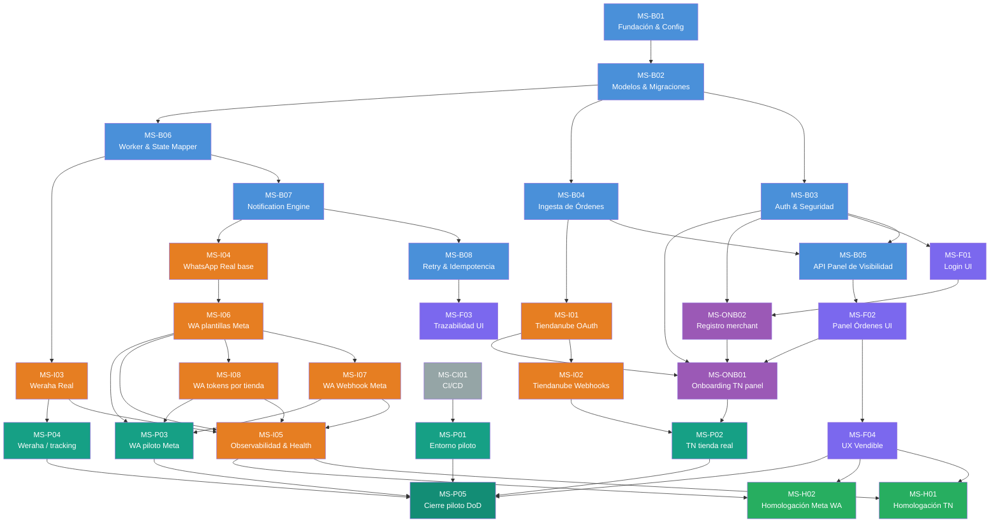

# Plan de Implementación por Milestones — WTA MVP

---

## Resumen ejecutivo

Este plan descompone el MVP del WhatsApp Tracking Assistant en **22+ milestones** en 3 tracks (Backend, Frontend, Integración) + **Onboarding** + post-MVP.

- **Track Backend** (B01–B08): 8 milestones — fundación → notificaciones con idempotencia
- **Track Frontend** (F01–F04): 4 milestones — login → panel vendible con trazabilidad
- **Track Integración** (I01–I08): 8 milestones — Tiendanube OAuth/webhooks, Weraha real, WhatsApp Cloud API (**I04** base; **I06–I08** Meta: plantillas, webhook firmado, tokens por tienda), observabilidad (**I05**)
- **Onboarding**: **ONB02** registro merchant (`POST /auth/register`, **ADR-004**) → **ONB01** vinculación Tiendanube desde el panel (OAuth con `state`, **ADR-002**); el grafo refleja esa secuencia recomendada
- **Post-MVP** (H01–H02): homologación Tiendanube App Store + homologación / App Review Meta (WhatsApp)
- **DevOps** (**MS-CI01**): GitHub Actions (lint, tests, seguridad, Docker, release), Dependabot, pre-commit — ver `CONTRIBUTING.md`
- **Piloto comercial** (**MS-P01–P05**): entorno, Tiendanube real, WhatsApp/Meta real, Weraha o decisión de tracking, cierre con DoD — detalle operativo en **`docs/PILOT_READINESS.md`**

**Metodología**: TDD estricto (Red → Green → Refactor) en cada milestone.

**Timeline estimado**: 8–11 semanas con un desarrollador fullstack asistido por agentes AI (incluye cadena **I04 → I06 → I07/I08** para WhatsApp alineado a Meta).

---

## Dependency Graph



---

## Track Backend (MS-B01 a MS-B08)

---

### MS-B01: Fundación & Config

- **Track**: Backend
- **Depende de**: ninguno
- **Objetivo**: FastAPI app base ejecutable con config desde env vars y health checks

**Estado en repo**: **cerrado**.

**Tasks**:

- [x] `backend/app/main.py` — FastAPI app, routers, `/static`
- [x] `backend/app/core/config.py` — `pydantic-settings` (`Settings`)
- [x] `backend/app/api/health.py` — `GET /health`, `GET /ready`
- [x] `backend/app/db/session.py` — engine SQLAlchemy, `get_db`
- [x] `backend/app/db/base.py` — `Base` declarativa
- [x] `tests/conftest.py` — `TestClient`, DB de test in-memory (SQLite + `create_all`)

**Tests TDD requeridos**:

- [x] `test_health_returns_ok` — `tests/test_api/test_health.py`
- [x] `test_ready_returns_ok` — idem
- [x] `test_settings_from_env` (+ `test_settings_has_all_required_fields`) — `tests/test_services/test_config.py`
- [x] `test_db_session_creates` — `tests/test_services/test_db.py`

**Test E2E del milestone**:

- [x] Ejecutable con `uvicorn` + health (validación manual / CI con TestClient)

**Criterio de completitud**: app arranca, responde en /health, se conecta a PostgreSQL de test

**Entregable deployable**: Sí — app en Heroku respondiendo /health

---

### MS-B02: Modelos & Migraciones

- **Track**: Backend
- **Depende de**: MS-B01
- **Objetivo**: Todos los modelos SQLAlchemy definidos + migración Alembic inicial ejecutable

**Estado en repo**: **cerrado** (modelos + migraciones sucesivas en `alembic/versions/`).

**Tasks**:

- [x] Modelo `Store` — `backend/app/models/store.py`
- [x] `StoreInstallation`, `StoreSettings` — idem
- [x] `StoreUser` — `backend/app/models/user.py`
- [x] `Order` — `backend/app/models/order.py`
- [x] `NotificationAttempt` — `backend/app/models/notification.py`
- [x] Alembic inicial + revisiones posteriores (WhatsApp, webhooks, etc.)

**Tests TDD requeridos** (`tests/test_services/test_models.py`):

- [x] `test_store_create` / `test_store_external_id_unique`
- [x] `test_store_settings_unique_per_store`
- [x] `test_order_belongs_to_store` / `test_order_requires_store`
- [x] `test_notification_attempt_idempotency_key_unique`
- [x] `test_store_user_email_unique`
- [x] `test_order_default_values`

**Test E2E del milestone**:

- [x] `alembic upgrade head` en deploy; tests usan `Base.metadata.create_all` sobre SQLite

**Criterio de completitud**: migración ejecuta sin error, todos los modelos CRUD funcionan

**Entregable deployable**: Sí — migración ejecutable en Heroku con `heroku run alembic upgrade head`

---

### MS-B03: Auth & Seguridad

- **Track**: Backend
- **Depende de**: MS-B02
- **Objetivo**: Login con JWT, endpoint /me, protección de rutas por store_id

**Estado en repo**: **cerrado** (registro de tienda incluido).

**Tasks**:

- [x] `backend/app/core/security.py` — bcrypt, JWT (`create_access_token`, verificación en dependencias)
- [x] `backend/app/schemas/auth.py` — login, registro, respuestas
- [x] `backend/app/api/auth.py` — `POST /auth/login`, `POST /auth/register`, `GET /me`
- [x] `backend/app/core/dependencies.py` — `get_current_user` → `store_id`
- [x] Rutas API protegidas con Bearer + scope por tienda
- [x] **Logout**: sin `POST /auth/logout` (JWT stateless); el cliente elimina el token (ver UI)

**Tests TDD requeridos** (`tests/test_api/test_auth.py`):

- [x] `test_hash_and_verify_password`
- [x] `test_create_and_decode_jwt`
- [x] `test_login_success` / `test_login_wrong_password` / `test_login_nonexistent_user`
- [x] `test_me_authenticated` / `test_me_unauthenticated` / `test_me_invalid_token`
- [x] Registro: `test_register_success_*`, validaciones duplicado / password / `store_name`

**Test E2E del milestone**:

- [x] Cadena login → JWT → `/me` cubierta por tests API

**Criterio de completitud**: flujo completo login → JWT → acceso protegido → aislamiento por store_id

**Entregable deployable**: Sí — login funcional en Heroku

---

### MS-B04: Ingesta de Órdenes (Mock)

- **Track**: Backend
- **Depende de**: MS-B02
- **Objetivo**: Endpoint webhook para recibir órdenes, normalizar teléfono y persistir

**Estado en repo**: **cerrado** (webhook firmado + validación de tienda).

**Tasks**:

- [x] `backend/app/services/phone.py` — E.164 + `invalid_phone`
- [x] `backend/app/schemas/order.py` — payloads / respuestas
- [x] `backend/app/api/orders.py` — `POST /webhooks/orders` (+ `GET /orders` en B05)
- [x] Extracción de tracking desde payload (p. ej. `shipping_tracking_number` en mock TN)
- [x] `current_status = pending_tracking` al crear
- [x] Idempotencia `external_id` + `store_id`

**Tests TDD requeridos**:

- [x] Normalización — `tests/test_services/test_phone.py` (`TestNormalizePhone`, variantes Paraguay + inválidos)
- [x] `test_webhook_creates_order` / `test_webhook_idempotent` / `test_webhook_normalizes_phone`
- [x] `test_webhook_invalid_phone_marks_order`
- [x] Seguridad: `test_webhook_invalid_signature`, `test_webhook_missing_signature`, `test_webhook_unknown_store`

**Test E2E del milestone**:

- [x] `tests/test_api/test_webhook_orders.py` + flujo real MS-I02 hacia el mismo modelo de orden

**Criterio de completitud**: órdenes se ingestan, normalizan y persisten correctamente

**Entregable deployable**: Sí — webhook funcional en Heroku recibiendo POSTs

---

### MS-B05: API Panel de Visibilidad

- **Track**: Backend
- **Depende de**: MS-B03, MS-B04
- **Objetivo**: GET /orders scopeado por store_id con filtros y paginación (contrato del RFC §9)

**Estado en repo**: **cerrado** (+ `GET /panel/stats` en `settings` router).

**Tasks**:

- [x] `GET /orders` con `get_current_user`, filtros y paginación — `backend/app/api/orders.py`

**Tests TDD requeridos** (`tests/test_api/test_orders_list.py`):

- [x] `test_get_orders_requires_auth`
- [x] `test_get_orders_scoped_by_store`
- [x] `test_get_orders_filter_by_status`
- [x] `test_get_orders_filter_by_notification_status`
- [x] `test_get_orders_pagination`
- [x] `test_get_orders_response_schema`
- [x] `test_get_orders_isolation`

**Test E2E del milestone**:

- [x] Cubierto por tests API anteriores

**Criterio de completitud**: API retorna órdenes aisladas por tienda con filtros y paginación

**Entregable deployable**: Sí — API consultable desde Postman/curl

---

### MS-B06: Worker & State Mapper (Mock Weraha)

- **Track**: Backend
- **Depende de**: MS-B02
- **Objetivo**: Polling worker que consulta tracking, mapea estados y actualiza DB

**Estado en repo**: **cerrado** (mock Weraha + tests HTTP reales en MS-I03).

**Tasks**:

- [x] `backend/app/services/weraha.py` — `WerahaAdapter.get_tracking_status`
- [x] `backend/app/services/state_mapper.py`
- [x] `backend/app/workers/polling.py` — elegibilidad RFC §12, `process_order`, notificación tras cambio de estado
- [x] Criterios: store activa, `tracking_number`, `onboarding_status=active` (teléfono se valida en ingesta / envío de WA)
- [x] Actualización `current_status`, `last_checked_at`, `last_status_change_at`
- [x] Logging estándar (`logger.info` / `exception`)

**Tests TDD requeridos**:

- [x] `test_mock_returns_status` — `tests/test_services/test_weraha.py`
- [x] `test_in_transit_variants` / `test_delivered_variants` / `test_unknown_returns_none` — `test_state_mapper.py`
- [x] `test_worker_selects_eligible_orders` / `test_worker_updates_order_status` / `test_worker_skips_inactive_store` / `test_worker_skips_no_tracking` / `test_worker_updates_last_checked` — `test_worker.py`

**Test E2E del milestone**:

- [x] Tests de worker sobre DB de test

**Criterio de completitud**: worker procesa órdenes elegibles y actualiza estados correctamente

**Entregable deployable**: Sí — worker ejecutable como `python -m backend.app.workers.polling`

---

### MS-B07: Notification Engine (Mock WhatsApp)

- **Track**: Backend
- **Depende de**: MS-B06
- **Objetivo**: Motor de notificaciones que decide cuándo enviar, usa WhatsApp (mock o real) y registra intentos

**Estado en repo**: **cerrado** (ampliado en MS-I06/I08: templates, `whatsapp_enabled`, `whatsapp_include_body_params`).

**Tasks**:

- [x] `backend/app/services/whatsapp.py` — mock + envío HTTP real
- [x] `backend/app/services/notification.py` — `NotificationEngine` (idempotencia, intentos, visibilidad en `Order`)
- [x] Integración en `backend/app/workers/polling.py`

**Tests TDD requeridos** (`tests/test_services/test_whatsapp.py` + `test_notification.py`):

- [x] Mock send success/failure — clase `TestWhatsAppService`
- [x] `test_sends_in_transit` / `test_sends_delivered` / `test_skips_already_notified`
- [x] `test_records_attempt` / `test_updates_order_visibility` / `test_sets_first_notification_at_once`
- [x] `test_invalid_phone_skips` (+ extensiones MS-I08: `test_whatsapp_disabled_skips_send`, `test_whatsapp_include_body_params_false_omits_order_id`)

**Test E2E del milestone**:

- [x] Tests de `TestNotificationEngine` + worker

**Criterio de completitud**: motor decide, envía (mock), registra y actualiza visibilidad

**Entregable deployable**: Sí — flujo completo worker → notification visible en API

---

### MS-B08: Retry & Idempotencia

- **Track**: Backend
- **Depende de**: MS-B07
- **Objetivo**: Retry strategy (1 retry, luego fail) + idempotencia robusta

**Estado en repo**: **cerrado** (+ MS-I06: no reintentar errores Graph permanentes).

**Tasks**:

- [x] Retry en `NotificationEngine` + `Retry-After` entre intentos cuando aplica
- [x] `notification_attempt` por intento con `attempt_number`
- [x] Idempotencia por `idempotency_key` + `status=sent`
- [x] `notification_error` / `notification_status` en `Order`
- [x] Caso tracking tardío: solo `delivered` si nunca hubo `in_transit`
- [x] Salida temprana sin 2.º intento si `graph_send_error_may_benefit_from_retry` es falso

**Tests TDD requeridos** (`tests/test_services/test_retry.py`):

- [x] `test_skip_second_attempt_on_permanent_graph_error`
- [x] `test_retry_on_first_failure` / `test_fail_after_retry` / `test_success_on_retry`
- [x] `test_idempotency_prevents_duplicate` / `test_retry_records_attempt_number`
- [x] `test_notification_error_visible` / `test_late_tracking_skips_in_transit`

**Test E2E del milestone**:

- [x] Cubierto por tests anteriores

**Criterio de completitud**: retry + idempotencia + casos borde cubiertos con tests

**Entregable deployable**: Sí — comportamiento resiliente observable en logs y DB

---

## Track Frontend (MS-F01 a MS-F04)

---

### MS-F01: Login UI

- **Track**: Frontend
- **Depende de**: MS-B03
- **Objetivo**: Página de login funcional con Jinja2 + CSS vendible

**Estado en repo**: **cerrado** (+ `register.html` / `GET /register` para MS-B03).

**Tasks**:

- [x] `base.html`, `login.html`, `style.css`, rutas en `backend/app/api/ui.py`
- [x] JS: login → JWT → redirect `/panel` (y registro equivalente)
- [x] Contenedor de errores (`loginError`)

**Tests TDD requeridos** (`tests/test_api/test_ui.py` — `TestLoginPage`):

- [x] `test_login_page_renders`
- [x] `test_login_page_has_form` (action POST `/auth/login`)
- [x] `test_login_page_has_error_container`

**Test E2E del milestone**:

- [x] Manual / navegador; flujo cubierto en parte por tests API de auth

**Criterio de completitud**: login visual, funcional y con feedback de errores

**Entregable deployable**: Sí — login usable en browser en Heroku

---

### MS-F02: Panel de Órdenes UI

- **Track**: Frontend
- **Depende de**: MS-B05
- **Objetivo**: Tabla de órdenes con estado logístico y de notificación visible al merchant

**Estado en repo**: **cerrado**. Auth de datos vía JWT en `fetch` (`/orders` 401 sin token); `GET /panel` sirve HTML y el guard JS redirige si no hay sesión.

**Tasks**:

- [x] `orders.html`, tabla, filtros, paginación, `GET /panel` en `ui.py`
- [x] Stats: `GET /panel/stats` + grid en panel (`test_panel_has_stats_grid`)

**Tests TDD requeridos** (`tests/test_api/test_ui.py` — `TestPanelPage`):

- [x] `test_panel_page_renders` / `test_panel_shows_orders_table`
- [x] `test_panel_has_filters` / `test_panel_has_pagination`
- [x] Protección API: `test_get_orders_requires_auth` (`test_orders_list.py`)

**Test E2E del milestone**:

- [x] Cubierto por tests UI + API; manual con merchant en staging

**Criterio de completitud**: merchant ve sus órdenes con estado y notificación en tabla navegable

**Entregable deployable**: Sí — panel usable en browser, demostrable a merchants

---

### MS-F03: Trazabilidad & Errores UI

- **Track**: Frontend
- **Depende de**: MS-B08
- **Objetivo**: Errores de notificación visibles, estados de retry y fallo claros en panel

**Estado en repo**: **cerrado** (badges / columnas en `orders.html` + lógica JS).

**Tasks**:

- [x] Badges por `notification_status`, columna de error, indicador `invalid_phone`, preview de template/mensaje en tabla

**Tests TDD requeridos** (`test_ui.py`):

- [x] `test_panel_has_badge_classes` — clases CSS para estados sent/failed/pending (y variantes)

**Test E2E del milestone**:

- [x] Manual + tests anteriores; asserts granulares por color opcionales

**Criterio de completitud**: estados de notificación y errores son visualmente claros

**Entregable deployable**: Sí — diferenciación visual de estados en panel

---

### MS-F04: UX Vendible & Refinamiento

- **Track**: Frontend
- **Depende de**: MS-F02
- **Objetivo**: Panel con calidad de producto vendible para demos y pilotos

**Estado en repo**: **cerrado** (`base.html` marca + `#storeName` desde `/me`, onboarding, ayuda, nav a settings).

**Tasks**:

- [x] Branding, nav (órdenes / configuración / ayuda según pantalla), empty/loading states, CSS responsive
- [x] Nombre de tienda: `#storeName` en header poblado por JS con `GET /me` (`store_name` o email)

**Tests TDD requeridos** (`test_ui.py`):

- [x] `test_panel_has_empty_state` / `test_panel_has_loading_state`
- [x] `test_panel_has_logout` / `test_panel_has_branding`
- [x] `test_panel_has_nav_links` / `test_settings_has_nav_links` / `test_css_loads`
- [ ] `test_panel_shows_store_name` — sin test dedicado (comportamiento en runtime vía `/me`; opcional añadir assert en HTML/JS)

**Test E2E del milestone**:

- [x] Flujo manual demo; piezas cubiertas por tests UI listados

**Criterio de completitud**: panel tiene calidad visual suficiente para una demo de ventas

**Entregable deployable**: Sí — producto demostrable a merchants reales

---

## Track Integración (MS-I01 a MS-I08)

---

### MS-I01: Tiendanube OAuth

- **Track**: Integración
- **Depende de**: MS-B04
- **Objetivo**: Flujo OAuth para conectar una tienda Tiendanube (legacy + ampliado por **MS-ONB01** con `state` y `install-url` API)

**Estado en repo**: **cerrado** para el flujo técnico base; el flujo **recomendado** para panel es **MS-ONB01** (`install-url` + callback con `state`).

**Tasks**:

- [x] `backend/app/services/tiendanube.py` — `TiendanubeService` (auth URL, `exchange_code` JSON, `fetch_order`, webhooks)
- [x] `GET /integrations/tiendanube/install` — redirect 302 a TN
- [x] `GET /integrations/tiendanube/callback` — `code` → token; crea/actualiza `Store` + `StoreInstallation`
- [x] Token TN en `store_installations.access_token` (**sin cifrar** en MVP; mejora de seguridad documentada en ADR/onboarding)
- [x] **MS-ONB01**: `GET /api/integrations/tiendanube/install-url`, callback con JWT `state`, etc.

**Tests TDD requeridos** (`tests/test_integrations/test_tiendanube_oauth.py`):

- [x] `test_install_redirects_to_tn`
- [x] `test_callback_exchanges_code` / `test_callback_invalid_code` / `test_callback_creates_store` / `test_callback_idempotent`

**Test E2E del milestone**:

- [x] Mocks + cadena **ONB01** (`test_tn_callback_valid_state_links_store`, etc.)

**Criterio de completitud**: merchant puede conectar su tienda de Tiendanube

**Entregable deployable**: Sí — flujo OAuth funcional (con tienda demo de TN)

---

### MS-ONB02: Registro merchant self-service

- **Track**: Onboarding (producto — Backend + Frontend)
- **Depende de**: MS-B03 (auth JWT, hash password), MS-B02 (modelos `Store` / `StoreUser` / `StoreSettings`)
- **Objetivo**: El vendedor **crea su cuenta** (email + contraseña + nombre de tienda) sin credenciales fijas en `.env`; tras registrarse recibe JWT y continúa el flujo **MS-ONB01** (vincular Tiendanube). Se elimina la dependencia operativa de `SEED_USER_EMAIL` / `SEED_USER_PASSWORD` en despliegues normales (el seed demo sigue siendo opcional para desarrollo).

**Flujo esperado**:

1. `GET /register` — formulario (email, contraseña, nombre de tienda).
2. `POST /auth/register` — valida contraseña (mín. 8 caracteres), email único; crea `Store` + `StoreSettings` (`onboarding_status=pending`) + `StoreUser` (rol `owner`); responde con `LoginResponse` (JWT).
3. Redirección del navegador a `/onboarding` si la tienda aún no tiene TN vinculado; en caso contrario a `/panel`.
4. `GET /me` (JWT) expone datos útiles para la cabecera: `store_name`, `tiendanube_user_id` (`external_store_id`), `needs_tiendanube` (derivado de instalación TN activa + `external_store_id`).

**Tasks — Backend**:

- [x] Schema `RegisterRequest` + `POST /auth/register` (201/409 según email duplicado).
- [x] Transacción atómica Store + Settings + User; `IntegrityError` → 409.
- [x] Ampliar `UserResponse` en `GET /me` con `tiendanube_user_id`, `needs_tiendanube`.

**Tasks — Frontend**:

- [x] Plantilla `register.html` + `GET /register`; enlace desde `login.html` y ayuda pública.
- [x] POST vía `fetch` a `/auth/register`, guardar JWT, redirigir según onboarding.

**Tests TDD requeridos**:

- [x] Registro OK → 201 + token + `store_id` en JWT decodificable
- [x] Email duplicado → 409
- [x] Contraseña corta → 422
- [x] `GET /me` tras registro: `needs_tiendanube` true en modo oauth_ready
- [x] UI: `GET /register` 200

**Criterio de completitud**: un merchant nuevo puede operar el producto sin variables `SEED_USER_*` en producción; el seed demo queda documentado solo para dev/CI.

**Entregable deployable**: Sí — mismo stack que login existente.

**Notas**: ver **ADR-004** en `docs/ADR.md`.

---

### MS-ONB01: Onboarding Tiendanube (vinculación desde el panel)

- **Track**: Onboarding (producto — cruza Backend + Frontend + Integración)
- **Depende de**: MS-B03 (auth JWT), MS-I01 (OAuth TN técnico), MS-F02 (panel existente), **MS-ONB02 recomendado** (cuenta merchant creada vía registro en lugar de seed)
- **Objetivo**: Todo merchant que **ingresa al sitio** (login en el panel) debe **vincular su tienda de Tiendanube** a la aplicación antes de usar el producto de forma completa; el `access_token` y el `user_id` de TN quedan asociados al **mismo** `Store` que el `StoreUser` autenticado, sin crear tiendas huérfanas ni duplicar registros.

**Contexto / problema hoy**: el callback de MS-I01 crea `Store` por `user_id` de TN sin relación con el usuario que ya inició sesión con otra `store_id` (p. ej. seed o registro previo). Este milestone cierra ese gap con flujo **autenticado + `state` OAuth**.

**Flujo esperado (alto nivel)**:

1. Merchant hace login → recibe JWT con `store_id`.
2. Si la tienda **no** tiene instalación TN activa (`store_installations` + token válido) o `onboarding_status` indica pendiente → redirigir o bloquear acceso a `/panel` y `/settings` mostrando **onboarding obligatorio**.
3. Pantalla **Conectar Tiendanube** con CTA que inicia OAuth incluyendo un **`state`** firmado (p. ej. JWT de corta vida con `store_id`, `exp`, posiblemente `nonce`).
4. Tiendanube redirige al callback con `code` + `state` → backend valida `state`, intercambia `code` por token (mismo contrato que MS-I01), persiste `access_token` en `StoreInstallation` del **store del JWT**, actualiza `Store.external_store_id` con `user_id` de TN, opcionalmente `Store.name` vía `GET /store` de la API TN, marca `StoreSettings.onboarding_status` acorde al PRD (p. ej. `tn_connected` o avanza hacia `active` según política definida).
5. Redirección amigable a `/panel` (o `/onboarding/success`) con mensaje de éxito.

**Tasks — Backend**:

- [x] Documentar y alinear **intercambio de token** con la API real de Tiendanube: `TiendanubeService.exchange_code()` usa **JSON** + `Content-Type: application/json` (validar en producción si TN exige `form-urlencoded` y añadir fallback si hiciera falta).
- [x] Generar **`state`** seguro: JWT firmado (`create_tn_oauth_state` / `decode_tn_oauth_state`), payload con `store_id`, `purpose: tn_oauth`, TTL 15 min.
- [x] Endpoint autenticado `GET /api/integrations/tiendanube/install-url`: Bearer obligatorio; responde JSON `{ "url" }` con URL TN que incluye `state=` (el front redirige con `window.location`; alternativa 302 no requerida).
- [x] Refactor de `GET /integrations/tiendanube/callback`: con `state` + `code` valida JWT → `store_id`, persiste en **ese** `Store`; sin `state` se mantiene flujo **legacy** (crear/actualizar por `user_id` TN).
- [x] Persistencia: `external_store_id`, upsert `StoreInstallation` TN activa, `StoreSettings.onboarding_status` → `active` tras éxito.
- [x] Política de **conflicto**: si `external_store_id` ≠ `user_id` TN → redirect browser a `/onboarding?error=store_conflict` (ver ADR-002).
- [x] `GET /api/onboarding/status` (JWT) para gating (`needs_tiendanube`, etc.) + `oauth_callback_url`, `webhook_public_url`, `tiendanube_app_configured` para UX y soporte.
- [x] `GET /api/integrations/tiendanube/install-url` devuelve **503** si faltan `TIENDANUBE_APP_ID` / `CLIENT_SECRET` (mensaje claro al usuario).
- [x] Tras vinculación: intento de `register_webhooks` (best-effort, log si falla).
- [x] Logs sin volcar `access_token` completo (solo metadatos / IDs).

**Tasks — Frontend (Jinja + JS)**:

- [x] `GET /onboarding`: flujo **paso a paso** (requisitos → autorizar en TN → listo), CTA destacada, muestra **URL actual** (`window.location.origin`) para evitar confusiones con `localhost` vs otra máquina.
- [x] Bloque **para soporte**: copiar callback OAuth y URL de webhooks (desde API), FAQ colapsable (acceso, errores).
- [x] `GET /ayuda/conectar-tiendanube` **pública** (sin login): guía en lenguaje de vendedor + enlace a login; pie de página global con enlace a ayuda.
- [x] `GET /login`: enlace a la guía; si ya hay JWT, redirige a `/onboarding` cuando `needs_tiendanube` (no mandar al panel a ciegas).
- [x] Cabecera: enlace **«Conectar tienda»** visible mientras `needs_tiendanube` (fetch a `/api/onboarding/status`).
- [x] **Guard** en `/panel`, `/settings` y post-login: si `needs_tiendanube` → `/onboarding`.
- [x] Mensajes post-callback vía query `?success=1` / `?error=…`; manejo de **503** al pedir `install-url`.
- [x] Deshabilitar CTA y aviso si `tiendanube_app_configured` es falso.
- [x] Textos en español orientados a merchant.

**Tests TDD requeridos**:

- [x] `test_onboarding_status_unauthenticated`
- [x] `test_onboarding_status_needs_tn`
- [x] `test_onboarding_status_linked`
- [x] `test_tn_install_url_requires_auth` (equivalente: install-url sin Bearer → 401)
- [x] `test_tn_install_url_contains_state` (equivalente: URL JSON incluye `state=`)
- [x] `test_tn_callback_valid_state_links_store`
- [x] `test_tn_callback_invalid_state_redirect` (redirect `invalid_state`; no 400 JSON en flujo browser)
- [x] `test_tn_callback_unknown_store_redirect` (`store_id` inexistente → `error=unknown_store`)
- [x] `test_tn_callback_store_conflict`
- [x] `test_exchange_code_sends_json`
- [x] `test_tn_install_url_503_when_tn_not_configured`
- [x] Tests UI: guía pública `/ayuda/conectar-tiendanube`, login con enlace ayuda, onboarding con pasos y bloques de copia

**Test E2E del milestone**:

- [x] Cubierto por la cadena de tests anteriores + UI `TestOnboardingPage` (`GET /onboarding`); E2E navegador manual con TN real queda como validación en staging.

**Criterio de completitud**: un usuario autenticado no puede usar el panel “de producción” sin completar la vinculación TN; tras vincular, ve su tienda correcta y el worker/webhooks (I02+) operan sobre el mismo `store_id`.

**Entregable deployable**: Sí — flujo demo reproducible con tienda TN de prueba (`user_id` / token como el obtenido con `authorization_code`).

**Notas de implementación**:

- URL de callback registrada en el portal de la app TN debe coincidir con `APP_BASE_URL/integrations/tiendanube/callback` (o ruta final acordada).
- Alcance OAuth (`scope`) debe incluir los permisos necesarios para órdenes y webhooks según RFC/PRD (el ejemplo real mostró `write_products`; validar si hace falta `read_orders` / scopes adicionales para MS-I02).
- Seed Docker: `SEED_TN_LINK_MODE=oauth_ready` (default) deja `external_store_id` vacío hasta OAuth → evita `store_conflict` con tiendas TN reales; `demo` mantiene panel con token placeholder (`docs/DOCKER.md`, tests `test_seed_oauth_e2e.py`).

---

### MS-I02: Tiendanube Webhooks

- **Track**: Integración
- **Depende de**: MS-I01 (MS-ONB01 recomendado antes en flujo “login panel primero” para que webhooks y órdenes caigan en el `store` correcto)
- **Objetivo**: Recibir webhooks de Tiendanube (order/created, order/fulfilled) y crear órdenes reales

**Tasks**:

- [x] Endpoint `POST /webhooks/tiendanube` que recibe payloads de TN
- [x] Verificación HMAC: validar `x-linkedstore-hmac-sha256` con `client_secret`
- [x] `order/created` / `order/paid`: **GET** orden en API TN (`TiendanubeService.fetch_order`) → crear orden local (el webhook oficial solo manda `store_id`, `event`, `id`)
- [x] `order/fulfilled`: `tracking_info` en `fulfillment_orders` (API con `aggregates=fulfillment_orders`) y/o campos del POST; si orden existe y el payload trae tracking, **sin llamada API** (latencia & tope 3s)
- [x] Registro webhooks en TN: `register_webhooks` en MS-I01/ONB (`order/created`, `order/paid`, `order/fulfilled`)
- [x] LGPD: `store/redact` (marca `Store.status=redacted`, desactiva instalaciones), `customers/redact` / `customers/data_request` → 200 ack (borrado profundo de PII fuera de MVP)
- [x] Objetivo **&lt; 3s**: timeouts cortos en `fetch_order` (2,5s); **503** si falla el fetch para que TN reintente

**Tests TDD requeridos**:

- [x] `test_webhook_hmac_valid`
- [x] `test_webhook_hmac_invalid`
- [x] `test_webhook_order_created` (mock API TN)
- [x] `test_webhook_order_fulfilled_updates_tracking`
- [x] `test_webhook_idempotent`
- [x] `test_webhook_store_redact` (+ instalación `is_active=False`)
- [x] `test_webhook_responds_fast`
- [x] `test_webhook_customers_redact` / `test_webhook_customers_data_request`
- [x] `test_webhook_tracking_info_from_payload_without_api_aggregate` (payload enriquecido / extensión)

**Test E2E del milestone**:

- [x] Cubierto por tests de integración con mock de `fetch_order`; validación manual contra TN en staging

**Criterio de completitud**: órdenes de Tiendanube llegan automáticamente al sistema

**Entregable deployable**: Sí — webhook URL configurada en portal de socios TN

---

### MS-I03: Weraha Real

- **Track**: Integración
- **Depende de**: MS-B06
- **Objetivo**: Reemplazar mock de Weraha por integración real con API de Weraha

**Estado en repo**: **parcial** — `WerahaAdapter` (`backend/app/services/weraha.py`) llama `GET {WERAHA_API_URL}/tracking/{id}` con `Authorization: Bearer {WERAHA_API_KEY}` y `timeout=10s` cuando `WERAHA_API_URL` es una URL HTTP(S) no vacía; si falta URL o es el placeholder `https://mock`, usa respuesta mock en proceso. **No** usa aún `store_settings.weraha_account_reference` por tienda (solo env global). Contrato público documentado del proveedor: pendiente de cerrar con Weraha.

**Tasks**:

- [ ] Investigar/documentar contrato oficial Weraha en producción (URL base, headers, shape JSON)
- [x] Llamada HTTP real vía `httpx.get` cuando hay `WERAHA_API_URL` configurada
- [x] Autenticación por API key global (`WERAHA_API_KEY` en `Settings`)
- [ ] Configuración per-store (`weraha_account_reference` / credenciales por tienda) cableada al adapter
- [x] Mapeo raw → interno en `state_mapper` (variantes EN_CAMINO / ENTREGADO / inglés — ver tests)
- [x] Manejo básico de errores: excepciones `httpx` → dict con `error` (sin tumbar el worker)
- [ ] Rate limiting explícito según límites Weraha
- [ ] Validación end-to-end contra API de staging/productiva Weraha

**Tests TDD requeridos** (`tests/test_integrations/test_weraha_real.py`):

- [x] `test_real_success` — mock `httpx.get` → JSON parseado
- [x] `test_real_not_found` — 404 / HTTPStatusError → resultado con error
- [x] `test_real_timeout` — `TimeoutException` → error capturado
- [x] `test_real_auth_error` — 401 → error capturado
- [x] `test_state_mapper_with_real_states` — variantes de estado → `in_transit` / `delivered`

**Test E2E del milestone**:

- [ ] Worker + API Weraha real (sin mock) en entorno controlado — pendiente

**Criterio de completitud**: tracking real de Weraha funciona end-to-end

**Entregable deployable**: Sí — worker consultando Weraha real en Heroku

---

### MS-I04: WhatsApp Real (envío HTTP base)

- **Track**: Integración
- **Depende de**: MS-B07
- **Objetivo**: Reemplazar mock de WhatsApp por **llamada HTTP real** a Meta Cloud API (`POST /{phone-number-id}/messages`). Este milestone es la **base técnica**; **MS-I06–I08** cierran el contrato completo con Meta (plantillas con variables, webhook, credenciales por tienda).

**Estado en repo**: **cerrado en código** — `WhatsAppService._real_send` + `httpx`; la URL base viene de `WHATSAPP_API_URL` (versión Graph explícita en env, p. ej. v21/v25). **MS-I06** añade `template.components` cuando hay `params` y políticas de payload/reintento ampliadas.

**Tasks**:

- [x] `WhatsAppService.send_template_message()` → `POST {WHATSAPP_API_URL}/{phone_number_id}/messages` — `backend/app/services/whatsapp.py`
- [x] Headers: `Authorization: Bearer {access_token}`, `Content-Type: application/json`
- [x] Body Cloud API: `messaging_product`, `to`, `type: template`, `template.name`, `template.language.code`; sin `params` / params vacíos → sin `components` (payload mínimo válido)
- [x] Parsear respuesta OK: `messages[0].id`; errores HTTP: JSON `error` vía `graph_error_result` (códigos/subcódigos y `Retry-After` en cabecera)
- [x] Mock vs real: flag `mock` en `WhatsAppService`, `resolve_for_store` (credenciales por tienda, fallback global, `APP_ENV` testing/development → mock si no hay credenciales)
- [x] `httpx.post(..., timeout=10.0)`; logs de error/advertencia sin token en claro; no se loguea el destinatario `to` en rutas estándar (solo `template_name`, HTTP status, `error.code` si aplica)

**Tasks en otros milestones** (alcance fuera del “envío HTTP base”):

- `template.components` / variables / `whatsapp_include_body_params` → **MS-I06**
- Webhook de Meta → **MS-I07**
- Credenciales per-store en UI, token persistido, rotación documentada → **MS-I08**

**Tests TDD** (implementados en `tests/test_integrations/test_whatsapp_real.py`, clase `TestWhatsAppReal`):

- [x] `test_real_send_success` — mock `httpx.post` → `message_id`
- [x] `test_real_send_failure` — 400 + JSON `error` → resultado con código/mensaje
- [x] `test_real_rate_limit` — 429 + `Retry-After` en mensaje/resultado
- [x] `test_real_invalid_phone` — 400 → fallo capturado
- [x] `test_template_body_correct` — estructura mínima del JSON alineada a Cloud API
- [x] `test_whatsapp_test_message` — envío con `params` (superposición con I06; mismo archivo)

**Test E2E del milestone**:

- [x] Camino HTTP ejercitado con `httpx` mockeado en `test_whatsapp_real.py`; persistencia de intentos y visibilidad en orden cubierta por `tests/test_services/test_notification.py` y `test_retry.py` (`NotificationAttempt` + `NotificationEngine`)

**Criterio de completitud**: existe un camino real de envío por HTTP registrado en `NotificationAttempt`

**Entregable deployable**: Sí — envío de prueba a números allowlist de Meta (plantillas **sin** variables o plantillas que no exijan `components`)

---

### MS-I06: WhatsApp — plantillas alineadas a Meta (Cloud API)

- **Track**: Integración
- **Depende de**: MS-I04
- **Objetivo**: Cumplir el **contrato exacto** de mensajes plantilla de la [Cloud API](https://developers.facebook.com/docs/whatsapp/cloud-api/guides/send-messages): incluir `template.components` (body con parámetros posicionales/nominales) cuando las plantillas `shipping_in_transit_v1` / `shipping_delivered_v1` tengan variables; mapear `NotificationEngine` → payload (`order_id`, nombres de template en Business Manager).

**Tasks — Backend**:

- [x] Extender `WhatsAppService.send_template_message(..., params)` para construir `components` según el esquema aprobado en el Administrador de WhatsApp (UTILITY recomendado para tracking) — implementado: `build_template_body_components`, orden `order_id` + claves alfabéticas
- [x] `store_settings.whatsapp_include_body_params` + UI/API: si es `false`, no se envían parámetros ni `components` (plantillas sin variables en el body)
- [x] Código de idioma de plantilla por `store_settings.whatsapp_template_language` (p. ej. `es`, `es_AR`)
- [x] Parsear errores Graph: `error.code`, `error.error_subcode`, `error.message` → resultado de envío y logs (sin volcar token) — `graph_error_result`
- [x] Manejo de **429**: leer `Retry-After` si viene — incluido en mensaje de error (backoff en worker pendiente)
- [x] Backoff entre reintentos cuando Graph devuelve `Retry-After` (motor de notificaciones)
- [x] Heurística de reintentos: no repetir envío ante códigos Graph típicamente permanentes — `graph_send_error_may_benefit_from_retry` (`whatsapp.py` + uso en `NotificationEngine`)

**Tests TDD requeridos**:

- [x] `test_whatsapp_template_includes_body_components` — con `params`, el JSON POST incluye `components` esperado
- [x] `test_whatsapp_graph_error_json_parsed` — respuesta 400 con JSON `error` → `error_code` / mensaje útil en resultado
- [x] `test_whatsapp_429_retry_after` — si aplica, respeta o registra cabecera de rate limit
- [x] `test_whatsapp_include_body_params_false_omits_order_id` — motor no pasa `params` cuando el flag de tienda es `false`
- [x] `test_graph_send_error_may_benefit_from_retry` / `test_skip_second_attempt_on_permanent_graph_error` — heurística de no reintentar códigos permanentes

**Criterio de completitud**: envío real con plantillas que tienen variables **no falla** por payload incompleto; mensaje coincide con la plantilla aprobada en Meta

**Entregable deployable**: Sí — mismo entorno que I04 con plantillas de producción validadas en Business Manager

---

### MS-I07: WhatsApp — Webhook Meta (verificación + firma)

- **Track**: Integración
- **Depende de**: MS-I06
- **Objetivo**: Exponer endpoints exigidos por Meta para **suscripción de webhooks**: verificación `GET` (`hub.mode`, `hub.verify_token`, `hub.challenge`) y **POST** con validación **`X-Hub-Signature-256`** usando el **App Secret** ([documentación webhooks](https://developers.facebook.com/docs/graph-api/webhooks/getting-started)). Procesar al menos `messages` (si aplica) y **`statuses`** (sent/delivered/failed/read) para enriquecer trazabilidad en panel / `NotificationAttempt`.

**Tasks — Backend**:

- [x] `GET /webhooks/whatsapp`: validar `verify_token` contra env `WHATSAPP_WEBHOOK_VERIFY_TOKEN`
- [x] `POST /webhooks/whatsapp`: body raw + firma `X-Hub-Signature-256` con `META_APP_SECRET`
- [x] Parser de `statuses[]`: correlacionar `id` (wamid) con `NotificationAttempt.provider_message_id`
- [x] Campos `provider_delivery_status`, `provider_delivery_status_at` en `NotificationAttempt` + migración Alembic
- [x] Idempotencia: actualizar el mismo registro si Meta reenvía el mismo estado (sin duplicar filas)
- [x] Documentar callback webhook HTTPS y pasos de suscripción — `docs/META_GO_LIVE_CHECKLIST.md`, `.env.example`, `WHATSAPP_META.md`
- [ ] Registrar URL del webhook en la app de Meta (acción manual en el portal de desarrolladores)

**Tests TDD requeridos**:

- [x] `test_whatsapp_webhook_verify_success` — GET con token correcto devuelve `challenge`
- [x] `test_whatsapp_webhook_verify_forbidden` — token incorrecto → 403
- [x] `test_whatsapp_webhook_post_rejects_bad_signature` — firma incorrecta → 403
- [x] `test_whatsapp_webhook_status_updates_attempt` — payload válido con `statuses` → correlación con attempt (mock)

**Criterio de completitud**: la app pasa verificación de webhook en el panel de desarrolladores y recibe eventos de estado en staging

**Entregable deployable**: Sí — URL HTTPS accesible desde Meta

---

### MS-I08: WhatsApp — credenciales por tienda y seguridad

- **Track**: Integración
- **Depende de**: MS-I06 (puede solaparse con I07 en paralelo tras I06)
- **Objetivo**: Dejar de depender de **un solo** `WHATSAPP_ACCESS_TOKEN` global en producción multi-merchant: persistir por `Store` / `StoreSettings` el `phone_number_id` y token de acceso (o flujo futuro **Embedded Signup** / System User por WABA). Cumplir buenas prácticas: secretos fuera del repo, cifrado en reposo si aplica, rotación documentada.

**Tasks — Backend / Datos**:

- [x] Migración: `store_settings.whatsapp_access_token` + `whatsapp_template_language` (token en claro MVP; cifrado en reposo = mejora futura)
- [x] `WhatsAppService.resolve_for_store` + uso desde `NotificationEngine` en cada envío
- [x] Política de fallback: `WHATSAPP_ALLOW_GLOBAL_FALLBACK` + doc en `.env.example`, `docs/WHATSAPP_META.md`, `DOCKER.md`
- [x] Panel **Configuracion** (`/settings`): formulario WhatsApp (Phone ID, token opcional, idioma, habilitar, borrar token) — ver `settings.html`
- [x] `NotificationEngine` respeta `whatsapp_enabled`: si la tienda lo desactiva, no se llama a la API de envío (`reason: whatsapp_disabled`)
- [ ] Flujo Embedded Signup / OAuth Meta completo (post-MVP vs asistido manual con token)
- [ ] Documentar rotación de tokens y uso de **System Users** / tokens de larga duración según [documentación Meta](https://developers.facebook.com/docs/whatsapp)

**Tasks — Seguridad**:

- [x] `GET /api/settings` no expone token; solo `whatsapp_token_configured`
- [ ] Checklist de cumplimiento: categoría UTILITY, opt-in del comprador al usar su teléfono (enlace a políticas en PRD)

**Tests TDD requeridos**:

- [x] `test_resolve_uses_store_credentials` / fallback / sin fallback en prod
- [x] `test_put_whatsapp_token_not_exposed_in_get` — token no aparece en JSON de respuesta
- [x] `test_whatsapp_disabled_skips_send` — con `whatsapp_enabled=false` no hay envío

**Criterio de completitud**: en entorno multi-tenant, cada tienda puede enviar con su propio número/token sin cruzar datos

**Entregable deployable**: Sí — al menos 2 tiendas de prueba con credenciales distintas

---

### MS-I05: Observabilidad & Health

- **Track**: Integración
- **Depende de**: MS-I03, MS-I06, MS-I07, MS-I08
- **Objetivo**: Health checks, métricas observables y logs según RFC §15 y §17, incluyendo señales de **WhatsApp/Meta** (errores Graph, entregas vía webhook I07, uso por tienda I08)

**Estado en repo**: **MVP parcial** — endpoints implementados en `backend/app/api/health.py`; agregados globales (sin filtrar por tienda). Logs: `logging` estándar en servicios/worker (no JSON estructurado por evento RFC §13).

**Tasks — implementado**:

- [x] `GET /health` — `{"status":"ok","version":"0.1.0"}` (sin última corrida del worker ni conteo de órdenes)
- [x] `GET /ready` — `SELECT 1` a DB; respuesta `database: connected|unavailable`
- [x] `GET /metrics` — agregados sobre **todas** las órdenes: `total_orders`, `orders_notified`, `pct_notified`, `orders_invalid_phone`, `pct_invalid_phone`, `orders_whatsapp_errors`, `pct_whatsapp_errors` (`notification_status == failed`)
- [x] Panel merchant: `GET /panel/stats` (por tienda, autenticado) en `settings` router

**Tasks — no implementado / mejora futura**:

- [ ] Última corrida worker u órdenes procesadas en `/health`
- [ ] Logs estructurados (JSON) para cada evento del RFC §13
- [ ] Métrica `tiempo_a_primera_notificacion` (promedio o histograma)
- [ ] `pct_errores_whatsapp` desagregado por `error.code` Graph (hoy solo fallos persistidos en orden)
- [ ] Ratio `delivered`/`sent` desde webhook (requiere agregación explícita; hoy hay `provider_delivery_status` en `NotificationAttempt`)
- [ ] Proteger `GET /metrics` (API key / IP allowlist / deshabilitar en prod público)

**Tests TDD requeridos** (`tests/test_integrations/test_observability.py`):

- [x] `test_health_includes_worker_status` — nombre histórico: valida presencia de `status` y `version` en `/health` (no incluye estado del worker)
- [x] `test_ready_checks_db` — `/ready` y DB `connected`
- [x] `test_metrics_endpoint` — forma del JSON de `/metrics`
- [x] `test_metrics_calculates_pct_notified`
- [x] `test_metrics_calculates_invalid_phone`
- [ ] `test_metrics_calculates_notification_time` — no hay campo en respuesta aún
- [ ] `test_logs_order_received` / `test_logs_notification_sent` — no hay aserciones de log estructurado

**Test E2E del milestone**:

- [x] Tests de integración anteriores; revisión manual en staging recomendada

**Criterio de completitud**: sistema es observable y monitoreable en producción

**Entregable deployable**: Sí — health checks y métricas visibles en Heroku

---

## DevOps & calidad (MS-CI01)

### MS-CI01: CI/CD GitHub Actions + prácticas DevOps

- **Track**: Infra / calidad
- **Depende de**: tests existentes (`pytest tests/`), Dockerfile en raíz
- **Objetivo**: Automatizar lint, tests, escaneos de seguridad y build de imagen Docker en cada push/PR; Dependabot y hooks opcionales en local.

**Estado en repo**: **implementado** — workflows numerados en `.github/workflows/`, `.pre-commit-config.yaml`, `.github/dependabot.yml`, `.github/CODEOWNERS`, `CONTRIBUTING.md`.

**Tasks**:

- [x] `01-lint-and-format.yml` — black, isort, flake8 (`.flake8`), validación YAML, pylint informativo (`continue-on-error`)
- [x] `02-tests.yml` — `pytest` + cobertura (`coverage.xml`), JUnit, Codecov opcional (`CODECOV_TOKEN`), reporte de checks (dorny/test-reporter, `continue-on-error` en forks)
- [x] `03-security.yml` — bandit, pip-audit (`continue-on-error`), Trivy filesystem + upload SARIF opcional
- [x] `04-docker-build.yml` — build; push a `ghcr.io/${{ github.repository }}` si no es PR
- [x] `05-release.yml` — release al etiquetar `v*`
- [x] Dependabot (pip, Docker, GitHub Actions)
- [x] CODEOWNERS (revisor `@lbertalot` — ajustar si cambia la org)
- [x] Pre-commit (hooks estándar + black/isort/flake8)
- [ ] Rama `main` protegida + checks obligatorios (configuración en GitHub, no en git)
- [ ] Codecov u otro dashboard de cobertura con token en producción (opcional)

**Tests / verificación**:

- [x] `pytest tests/` en verde en local y en job `02-tests.yml`

**Criterio de completitud**: PRs a `main`/`develop` ejecutan lint + tests en Actions; imagen Docker construible en CI.

**Entregable deployable**: No aplica directamente — mejora el pipeline de entrega.

---

## Track Piloto comercial (MS-P01 a MS-P05)

> Objetivo: **una tienda real** con flujo TN + WhatsApp medible según la **definición de hecho** en [`docs/PILOT_READINESS.md`](PILOT_READINESS.md). Estos hitos son en gran parte **operativos y de validación**; el código base asume **MS-I02, MS-ONB01, MS-I06–I08** y worker desplegado.

---

### MS-P01: Entorno de ejecución piloto

- **Track**: Piloto / infra
- **Depende de**: MS-CI01 (recomendado), despliegue existente (Heroku/Docker), MS-B02 (migraciones)
- **Objetivo**: Staging o producción **acotada** con Postgres, `web` + `worker`, variables de entorno mínimas y sin secretos en repo.

**Tasks**:

- [ ] `DATABASE_URL` productiva; `alembic upgrade head` aplicado
- [ ] `SECRET_KEY` fuerte; `APP_BASE_URL` HTTPS coherente con callbacks TN/WA
- [ ] Proceso **web** (uvicorn) y **worker** (polling) activos con `POLL_INTERVAL_SECONDS` acorde al piloto
- [ ] `APP_ENV=production` (o equivalente) si se requieren envíos WhatsApp **reales** (`resolve_for_store` no debe caer en mock por `development` sin credenciales)
- [ ] Logs accesibles (Heroku logs / Docker) para incidencias

**Criterio de completitud**: health/ready verdes; worker corre ciclos sin error de conexión a DB

**Entregable deployable**: Sí — URL estable para merchants de prueba

---

### MS-P02: Tiendanube — tienda real conectada

- **Track**: Piloto / integración
- **Depende de**: MS-ONB01, MS-I02, MS-P01
- **Objetivo**: App TN configurada; OAuth desde el panel; webhooks entregando órdenes al `store_id` correcto.

**Tasks**:

- [ ] App en consola Tiendanube con `TIENDANUBE_APP_ID` / `TIENDANUBE_CLIENT_SECRET` alineados al servidor
- [ ] Redirect/callback: `{APP_BASE_URL}/integrations/tiendanube/callback`
- [ ] Validar **scopes** en la app TN (el código no agrega `scope` en `TiendanubeService.get_auth_url()` — depende de la app)
- [ ] Merchant: registro → OAuth → `StoreInstallation` con token; `onboarding_status` **active**
- [ ] Webhooks registrados hacia `{APP_BASE_URL}/webhooks/tiendanube` (post-OAuth en `register_webhooks`; revisar logs ante fallos)
- [ ] Prueba **order/created** o **order/paid** → fila en `orders` con teléfono o `invalid_phone` explícito
- [ ] Prueba **order/fulfilled** → `tracking_number` poblado (payload o `GET` con agregados)
- [ ] Confirmar criterio de firma HMAC TN vs `TIENDANUBE_CLIENT_SECRET` en `webhooks_tn.py`

**Criterio de completitud**: al menos un pedido real o de staging TN visible en el panel WTA

**Entregable deployable**: Sí — tienda real “en vivo” en WTA

---

### MS-P03: WhatsApp / Meta — envío y webhook en piloto

- **Track**: Piloto / integración
- **Depende de**: MS-I06, MS-I07, MS-I08, MS-P01, MS-P02 (orden con tracking/teléfono)
- **Objetivo**: Plantillas Meta alineadas al código; `whatsapp_enabled=true`; webhook `statuses` opcional pero recomendado.

**Tasks**:

- [ ] Plantillas aprobadas; nombres = `template_in_transit` / `template_delivered` o defaults del motor (`shipping_in_transit_v1`, `shipping_delivered_v1`)
- [ ] `whatsapp_template_language` y cuerpo de plantilla alineados a `build_template_body_components` (`order_id` primero) o `whatsapp_include_body_params=false` si no hay variables
- [ ] Credenciales: por tienda en panel **o** fallback global + política clara (`WHATSAPP_ALLOW_GLOBAL_FALLBACK`)
- [ ] **Activar** `whatsapp_enabled` en `store_settings` (el registro lo deja en `false` en `auth.py`)
- [ ] Webhook Meta: `GET/POST /webhooks/whatsapp`, `META_APP_SECRET`, `WHATSAPP_WEBHOOK_VERIFY_TOKEN`, HTTPS público
- [ ] Prueba de envío a número permitido (sandbox/Live según modo Meta)
- [ ] Verificar `NotificationAttempt` y, si aplica, `provider_delivery_status` tras eventos Meta

**Criterio de completitud**: al menos un mensaje template entregado al cliente de prueba con trazabilidad en panel

**Entregable deployable**: Sí — canal WA funcional para la tienda piloto

---

### MS-P04: Weraha o fuente de estado de envío acordada

- **Track**: Piloto / logística
- **Depende de**: MS-I03 (parcial en código), MS-B06, MS-P02
- **Objetivo**: El worker obtiene transiciones **in_transit** / **delivered** de forma predecible para el piloto.

**Tasks**:

- [ ] **Opción A**: `WERAHA_API_URL` + `WERAHA_API_KEY` reales; validar que la respuesta JSON mapee con `state_mapper` / adapter (`GET {base}/tracking/{tracking_number}`)
- [ ] **Opción B** (explícita): piloto sin Weraha — acordar que los estados vienen solo de TN / datos ya en orden y documentar limitaciones (puede no disparar segunda notificación sin transición)
- [ ] Si se usa mock accidentalmente (URL vacía o `https://mock`), documentar que **no** representa logística real

**Criterio de completitud**: al menos una transición de estado logística reflejada en `Order.current_status` antes del envío WA de “entregado”

**Entregable deployable**: Parcial — depende del acuerdo con Weraha o TN

---

### MS-P05: Cierre del piloto — DoD y handoff

- **Track**: Piloto / producto
- **Depende de**: MS-P01, MS-P02, MS-P03, MS-P04; MS-F04 (panel usable)
- **Objetivo**: Cumplir la **definición de hecho** unificada y dejar registro de incidentes y próximos pasos.

**Tasks**:

- [ ] Verificar DoD en [`PILOT_READINESS.md`](PILOT_READINESS.md) §10 (pedido real TN → orden → transiciones → templates WA → panel + webhook opcional)
- [ ] Lista de issues encontrados (TN scopes, Graph errors, teléfonos, tracking)
- [ ] Decisión documentada: multi-merchant estricto vs fallback global para siguiente fase
- [ ] Actualizar `PILOT_READINESS.md` o este archivo si el comportamiento del código cambió durante el piloto

**Criterio de completitud**: sign-off interno (producto + técnico) sobre el piloto de una tienda

**Entregable deployable**: No — artefacto de aprendizaje + posible entrada a MS-H01 / MS-H02

---

## Post-MVP (MS-H01)

---

### MS-H01: Homologación Tiendanube

- **Track**: Post-MVP
- **Depende de**: MS-F04, MS-I05
- **Objetivo**: Preparar artefactos para publicar app en Tienda de Aplicaciones de Tiendanube

**Tasks**:

- [ ] Diagrama de secuencia del flujo OAuth → webhook → notificación
- [ ] Video demo:
  - Flujo de instalación desde Tiendanube
  - Escenario merchant sin cuenta (crear cuenta)
  - Escenario merchant con cuenta (login)
  - Escenario de reinstalación
  - Simulación de todos los flujos del diagrama de secuencia
  - Guía de instalación completa
- [x] Webhooks LGPD base cubiertos en **MS-I02** (`store/redact`, `customers/redact`, `customers/data_request` — ack / redact según implementación actual); profundizar borrado PII si exige auditoría TN
- [ ] Revisar checklist de homologación async
- [ ] Evaluar si migrar a app integrada (requiere Nimbus/React — decisión futura)

**Tests TDD requeridos**:

- [x] Cubierto en MS-I02 — `test_webhook_store_redact`, `test_webhook_customers_redact`, `test_webhook_customers_data_request` (`tests/test_integrations/test_tiendanube_webhooks.py`)

**Criterio de completitud**: artefactos enviados a publicacion@tiendanube.com

**Entregable deployable**: No — es un proceso externo

---

### MS-H02: Homologación Meta (WhatsApp Business Platform / App Review)

- **Track**: Post-MVP
- **Depende de**: MS-F04, MS-I05, MS-I06, MS-I07, MS-I08
- **Objetivo**: Completar requisitos típicos de **revisión de app** y buenas prácticas de Meta para uso productivo de la Cloud API: demostración de uso aceptable de plantillas, webhook verificado, manejo de datos del usuario, documentación de privacidad y flujo de onboarding del comercio.

**Tasks**:

- [ ] Checklist oficial [Meta for Developers](https://developers.facebook.com/docs/whatsapp/overview) (permisos, casos de uso, Business Verification si aplica)
- [ ] Video / capturas: envío de plantilla UTILITY de tracking, recepción de `statuses` en el sistema
- [ ] Política de retención y uso de números de teléfono clientes (LGPD / ley aplicable) documentada
- [ ] Si se ofrece como **Tech Provider**: evaluar Embedded Signup y requisitos adicionales (fuera de alcance MVP → documentar decisión en ADR)
- [ ] Entorno de prueba con números verificados y plantillas aprobadas en el WABA de staging

**Tests / evidencias**:

- [ ] Lista de pruebas manuales reproducibles (staging) enlazada desde README o `docs/`
- [ ] Evidencia de que webhook POST rechaza firmas inválidas (test automatizado de I07)

**Criterio de completitud**: envío a revisión de Meta con paquete de evidencias acordado por el equipo legal/producto

**Entregable deployable**: No — proceso en el portal de Meta

---

## Matriz de Trazabilidad

| Milestone | PRD | RFC | ADR |
|-----------|-----|-----|-----|
| MS-B01 | — | §17 (health, ready) | Decisión: FastAPI, Heroku |
| MS-B02 | §5 (funcionalidades MVP) | §5 (tenancy), §6 (orders), §7 (notification_attempts) | Multi-merchant día 1, Estructura repo |
| MS-B03 | §4 (onboarding simple) | §8 (auth), §19 (seguridad) | Acceso al panel, Auth propia |
| MS-B04 | §5 (integración fuente órdenes), §5 (normalización teléfonos) | §3.1 (ingesta), §3.2 (phone), §12 (elegibilidad) | Arquitectura general |
| MS-B05 | §3 (visibilidad), §5 (panel mínimo) | §9 (panel visibilidad CRÍTICO) | UI vendible día 1, Lineamientos UI |
| MS-B06 | §5 (integración Weraha), §6 (eventos) | §3.3 (polling), §3.4 (weraha), §3.5 (state mapper), §12 (elegibilidad) | Fase 2, Polling tradeoff |
| MS-B07 | §5 (notificaciones WhatsApp), §7 (mensajes) | §3.6 (notification engine), §3.7 (whatsapp), §7 (idempotencia) | Fase 3, Meta API tradeoff |
| MS-B08 | §11 (riesgos) | §14 (retry), §7 (idempotencia), §18 (casos borde) | Trazabilidad e idempotencia |
| MS-F01 | §4 (onboarding simple) | §8 (auth endpoints) | UI vendible, Acceso al panel |
| MS-F02 | §3 (visibilidad VENTAJA PRINCIPAL) | §9 (panel completo) | Lineamientos UI del panel |
| MS-F03 | §3 (error visible) | §18 (casos borde visibles) | Observable día 1 |
| MS-F04 | §12 (éxito de producto) | — | UI vendible, Principios |
| MS-I01 | §5 (integración fuente órdenes) | §3.1 (ingesta), §10 (flujo activación paso 1) | Arquitectura general |
| MS-ONB01 | §4 (onboarding simple), §5 (fuente TN) | §8 (auth), §10 (activación), §3.1 (vinculación merchant) | Panel vendible, tenancy |
| MS-I02 | §5 (integración fuente órdenes) | §3.1 (ingesta webhooks) | Arquitectura general |
| MS-I03 | §5 (integración Weraha) | §3.4 (weraha adapter), §10 (paso 2) | Fase 2, Polling |
| MS-I04 | §5 (notificaciones WhatsApp), §7 (mensajes) | §3.7 (whatsapp service), §11 (prerequisitos), §10 (pasos 3-4) | Fase 3, Meta API |
| MS-I06 | §5 (notificaciones), §7 | §3.7 (whatsapp), §11 | Meta Cloud API plantillas; **ADR-005** |
| MS-I07 | §5 (trazabilidad notificación) | §15, §17 | Webhooks Meta, firma App Secret; **ADR-005** |
| MS-I08 | §5 (multi-merchant), §11 | §3.7, §5 (tenancy) | Tokens por tienda, seguridad |
| MS-I05 | §8 (métricas clave) | §15 (métricas), §17 (observabilidad) | Observable día 1 |
| MS-CI01 | — | — | Calidad entrega; `CONTRIBUTING.md` |
| MS-P01 | §12 (piloto) | — | [`PILOT_READINESS.md`](PILOT_READINESS.md) — entorno |
| MS-P02 | §5 (TN), §12 | §3.1 | TN real; ADR-002/003 |
| MS-P03 | §5 (WA), §12 | §3.7, §11 | Meta piloto; **ADR-005**; `WHATSAPP_META.md` |
| MS-P04 | §5 (Weraha) | §3.4 | Weraha real o decisión tracking |
| MS-P05 | §12 (éxito producto) | — | DoD piloto; `PILOT_READINESS.md` §10 |
| MS-H01 | §9 (Go-To-Market canal) | — | — |
| MS-H02 | §5 (WhatsApp), cumplimiento | §11, §19 | Homologación Meta / App Review |

---

## Definition of Done Global (MVP completo)

Checklist final alineada con RFC §20 y PRD §12:

### Éxito técnico

> Checklist **respecto al código + tests** del repo. Criterios de **negocio** (p. ej. pilotos reales) siguen abajo.

- [x] **Órdenes procesadas** — TN: `POST /webhooks/tiendanube` + fetch API (ADR-003); mock legacy `POST /webhooks/orders` — tests en `test_tiendanube_webhooks`, `test_webhook_orders`
- [x] **Tracking funcionando** — worker + `WerahaAdapter` (mock o HTTP según `WERAHA_API_URL`) — `test_worker`, `test_weraha_real`
- [x] **Notificaciones enviadas** — motor + Graph con plantillas/params (MS-I06) — tests servicios/notificación/WhatsApp
- [x] **Webhook WhatsApp** — `GET/POST /webhooks/whatsapp`, firma Meta — `test_whatsapp_webhook`
- [x] **Credenciales WhatsApp por tienda** — `store_settings` + `resolve_for_store`; fallback global solo si `WHATSAPP_ALLOW_GLOBAL_FALLBACK=true` — en **prod multi-merchant** operativamente conviene `false` + tokens en panel (**MS-I08**)
- [x] **Panel visible** — `GET /orders`, plantillas panel — tests UI/API
- [x] **Errores trazables** — `notification_status`, intentos, panel — MS-B08 / F03
- [x] **Acceso aislado por tienda** — consultas filtradas por JWT `store_id` — p. ej. `test_get_orders_isolation`, `test_update_settings_isolation`, `test_panel_stats_scoped_by_store`
- [x] **Onboarding persistido** — `StoreSettings` (incl. flags WhatsApp, plantillas)
- [x] **Tiendanube vinculada al panel** — OAuth con `state` (ADR-002) — tests onboarding / seed E2E

### Éxito de producto

- [ ] **3 tiendas activas** — 3 merchants de Paraguay usando el sistema
- [ ] **Merchant percibe reducción de soporte** — validación manual en pilotos
- [ ] **Visibilidad utilizada** — merchants acceden al panel regularmente
- [ ] **Tiempo a primera notificación < 1 día** — métrica de producto; en código aún **no** hay endpoint dedicado (solo datos en orden / panel stats) — ver gap MS-I05

### Tests

- [x] **Todos los tests pasan** — correr `pytest tests/` en local/CI (objetivo green)
- [ ] **Cobertura de servicios > 80%** — objetivo RFC; no medido de forma obligatoria en CI en este repo
- [ ] **Tests E2E por milestone** — hay integración amplia por área; no todo milestone tiene un único test E2E con nombre 1:1
- [x] **Mocks de APIs externas** — httpx/Meta/TN mockeados en tests; sin llamadas reales obligatorias

### Deploy

- [ ] **App corriendo en Heroku** — web dyno + worker dyno + scheduler + postgres
- [x] **Health / readiness** — `GET /health` → 200 `{status, version}`; `GET /ready` comprueba DB — **sin** “última corrida worker” en `/health` aún (MS-I05)
- [ ] **Migraciones aplicadas** — `alembic upgrade head` ejecutado en producción
- [ ] **Variables de entorno configuradas** — todas las vars relevantes del `.env.example` / `.env.docker.example` con valores reales en el entorno

---

## Orden de ejecución recomendado

```
Semana 1:  MS-B01 → MS-B02
Semana 2:  MS-B03 + MS-B04 (paralelo)
Semana 3:  MS-B05 + MS-F01 (paralelo) → MS-B06
Semana 4:  MS-F02 + MS-B07 (paralelo)
Semana 5:  MS-B08 + MS-I01 (paralelo) → MS-F03
Semana 5b: MS-ONB01 (tras F02 + I01 listos) — onboarding TN obligatorio en panel
Semana 6:  MS-I02 + MS-I03 (paralelo)
Semana 7:  MS-I04 + MS-F04 (paralelo)
Semana 8:  MS-I06 → MS-I07 + MS-I08 (I07 e I08 en paralelo tras I06)
Semana 9:  MS-I05 → Validación final (health + métricas Meta)
Post-MVP:  MS-H01 (Tiendanube) + MS-H02 (Meta / App Review)
```
